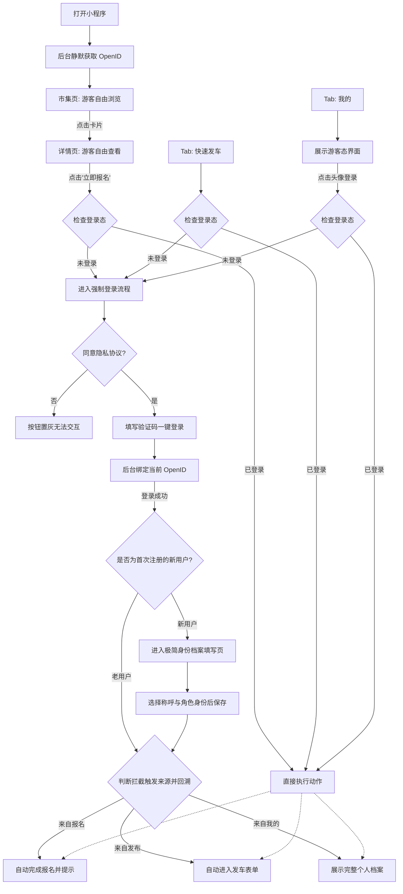
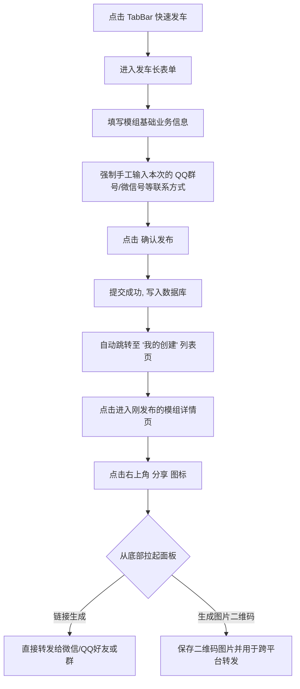
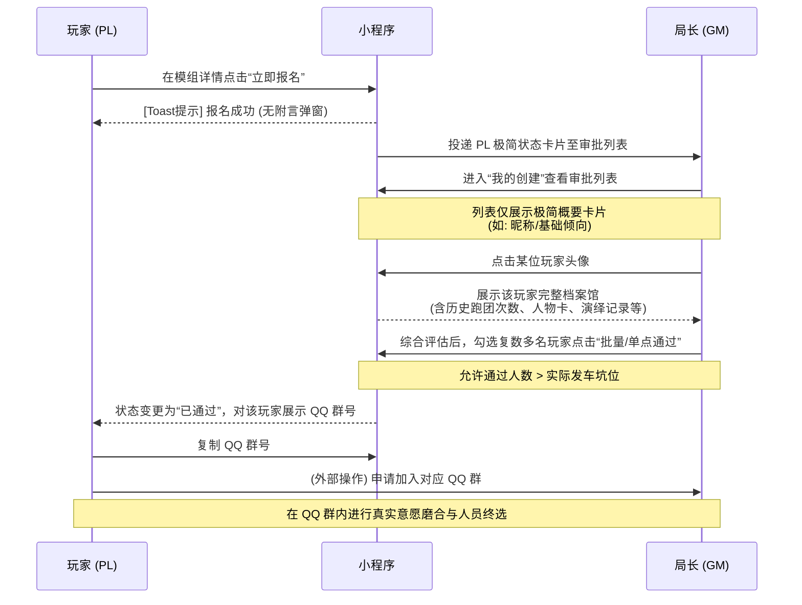

# COC（小程序）PRD

> 状态：编写中...
> 适用端：微信小程序 / QQ 小程序（双端互通）

## 1. 文档目标
本文档用于统一 COC（TRPG 极简组局小程序）的产品范围与交互标准，作为后续设计、开发和验收的依据。核心理念为：极简高效，不改变玩家原有 QQ 群跑团习惯。

## 2. 产品定位与角色
- **目标用户**：TRPG 跑团局长（KP/DM）及 玩家（PL/PC）。
- **核心价值**：极简完成找团与发车。
- **角色权限**：
  - **GM (局长)**：发车招募、审批申请
  - **PL (玩家)**：浏览招募、报名上车
  - (由于双向选择，同一账户可同时具备 GM 和 PL 历史档案)

---

## 4. 信息架构

极简架构，摒弃繁复的搜索和多层级嵌套。

### 4.1 一级页面（Bottom TabBar）

- `市集 (Home)`：默认首页，展示核心招募列表。顶端带轻量级筛选和搜索。
- `快速发车 (Publish)`：底部中间高亮加号，点击不弹窗，直接进入长表单沉浸式发布页。发布成功后跳转至“我的创建”以方便再次编辑和状态管理。
- `我的 (Mine)`：个人中心与管理调度枢纽，承载流程流转与档案入口。

### 4.2 二级页面与组件级独立页

#### 招募与详情线
- `模组详情页`：从市集进入，PL 报名、查看核心跑团信息及要求的重点页面。
- *(注：无独立搜索结果页，所有轻量筛选与搜索的结果直接在“市集”列表中刷新呈现。)*

#### 管理与状态线 (双边管理)
- `我的创建`：发布管理页。GM 在此查看自己发起的模组状态进行操作（如：审批申请列表、修改信息、确认结团）。
- `我的申请`：PL 在此查看自己的报名是否通过，审批通过后可在此获取隐藏的联系方式（QQ群号等）。

#### 档案与社交资产线
- `个人档案馆/他人主页`：通过点击头像进入。展示用户公开透明的历史数据作为双向选择依据，包含：
  - 属性面板（跑团履历、偏好等）
  - 人物卡
  - 演绎记录
  - 跑团板
- `我的足迹`：浏览过的历史招募记录。
- `我的心愿单`：想玩/收藏的模组列表。

#### 基础杂项线
- `设置页`：通用系统设置。
- `编辑资料页`：个人基础信息编辑。

---

## 5. 关键流程

### 5.1 登录与档案初始化流程 (核心流程)

**1. 游客模式与页面访问权限**
为了保留最大化的留存转化，小程序分为开放区和受限区：
- **开放区（游客自由浏览）**：`市集` (Home) 与 `模组详情页` (Detail)。游客可随意查看招募卡片和招募详情。
- **受限区（触发登录拦截）**：
  - **报名动作**：在详情页点击“立即报名”时。
  - **快速发车**：点击底部 TabBar 的“发车”按钮时。
  - **我的主页**：点击“我的”页面头像/数值统计区时（未登录时展示默认占位图与引导文案，统计数值如“我的创建”等显示为 `--`）。

**2. 核心登录逻辑与一步到位档案构建**
这个流程不仅解决了登录验证，更通过流程串联，将繁杂的信息录入降至最低，确保未来的发车操作不再被打断：
- **静默登录辅助**：启动时执行 `uni.login` 获取 openid。
- **极简登录页**：点击核心动作触发拦截后弹出。勾选**隐私协议** -> 填手机号获取验证码 -> **一键登录即注册**。
- **登录即建档 (核心改动)**：当系统发现用户是刚刚**全新注册**时，登录成功后的下一秒会**强制进入一个“极简档案填写页”**（例如：选一下称呼、选一下自己常玩 KP 还是 PL）。这是一个极具仪式感且必填的一步。
- **免打扰承诺**：通过在这个环节让用户把最小必填档案完成，后续无论怎么报名、怎么发车，或者退出重登，系统都绝不再次弹窗要求填写档案。所有修改均收拢至“我的-编辑资料”。
- **无缝回溯**：档案建完（或老用户直接登录完毕）后，自动**执行刚才引发拦截的那个动作**（比如：弹框提示“报名成功” / 或者直接进入发车表单输入界面）。

**页面与交互流程图：**

---

### 5.2 极简发车流程 (GM视角)

**核心逻辑与规则：**
- **联系方式全部硬填**：长表单中的所有联系方式（QQ群号、QQ号、微信号）**不保留任何历史记录与记忆**，每次发车都必须由 GM 重新手动输入。这确保了每次发车的联系群组都是绝对准确且当期有效的，避免自动回填导致的无效申请。
- **发布后的顺畅流转**：点击“发布”成功后，系统不做强行阻断式弹窗，而是**直接跳转回“我的创建”列表页**，让 GM 能够立刻看到自己刚发的车辆状态。
- **场景化分享闭环**：在“模组详情页”的右上角，提供明确的 `[分享]` 图标入口。点击后从底部拉起面板，提供两种跨平台传播方式：
  1. **链接生成**：一键生成小程序专属链接，可直接转发给微信好友或微信群。
  2. **生成图片二维码**：一键生成带小程序二维码的精美图片，GM 可以直接保存并转发到微信或 QQ 的好友/群中，进行跨平台宣传。

**交互流程图：**

---

### 5.3 报名与审批流程 (双向互动)

该小程序的定位是“极简信息过载过滤器”。复杂的对戏与磨合交由真正的跑团 QQ 群完成，小程序仅负责初步的【档案投递】与【身份筛查】。

**1. 极简报名 (PL视角)**
- **零阻力投递**：当 PL 在模组详情页浏览完毕，确认满足上车条件后，点击底部的“立即报名”按钮，系统将**一键直接弹出“报名成功”Toast**，无需再填写任何申请附言或弹窗打断。报名人的极简档案数据将静默同步至 GM 的审批区。

**2. 审批与档案查阅逻辑 (GM视角)**
- **极简初筛与深度查阅**：在“我的创建 -> 审批列表”中，GM 初始只能看到报名人的一张极简信息卡片（例如：昵称、基础倾向等）。如果想进一步了解某位玩家，GM 可以**点击该玩家的头像**，下钻进入其详尽的个人档案馆。在档案中，GM 可以查阅该玩家之前的跑团次数记录、核心人物卡、演绎表现等深度信息，作为最终是否放行的重要依据。
- **超额发放 Offer**：评估完玩家档案后，即便该模组只需 4 个人参与，但如果有 6 个符合眼缘的玩家，GM 依然可以自由勾选，**将这 6 个人全部通过许可**。
- **群内终选**：小程序只作为“入群资格”的简易分发器。被通过审批的全部玩家都将获得该团的 QQ 群号并加群。最终活动能否跑成、哪些玩家构成组局车队，全凭大家在 QQ 群内的进一步沟通和磨合。小程序不设置死板的“满员自动清退”拦截，保持最大的灵活性。

**交互流转时序图：**

