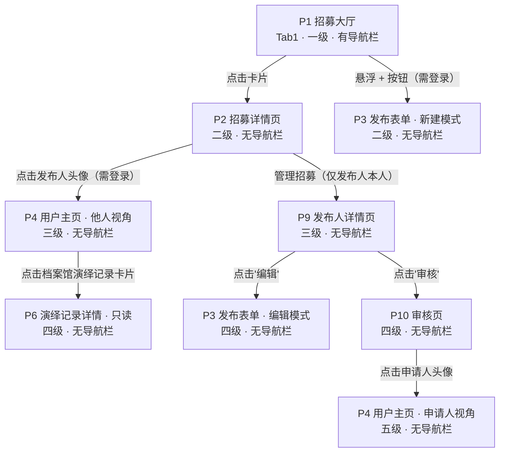
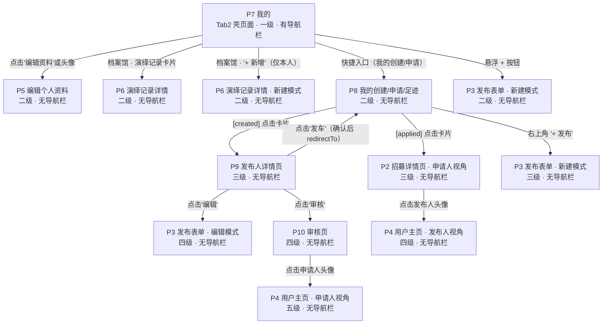
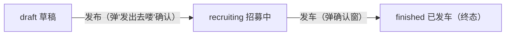
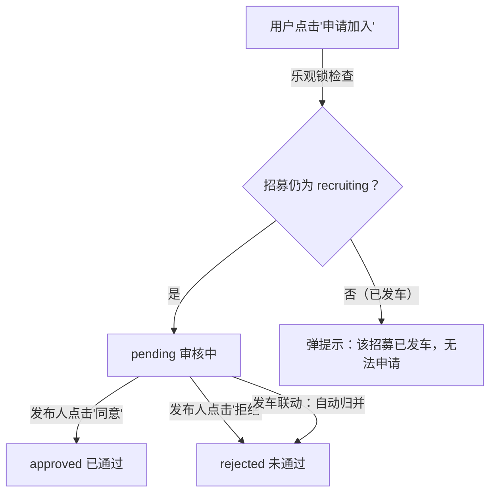
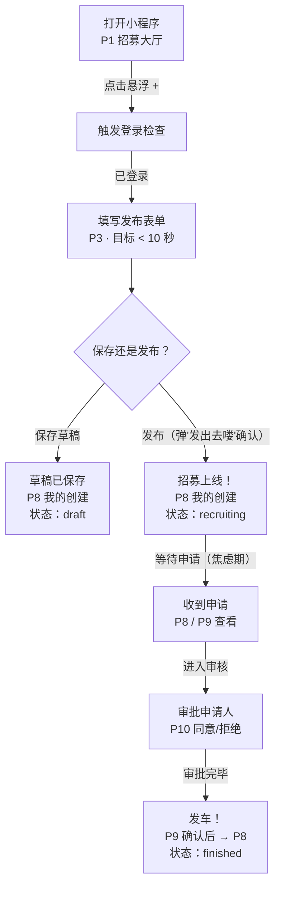
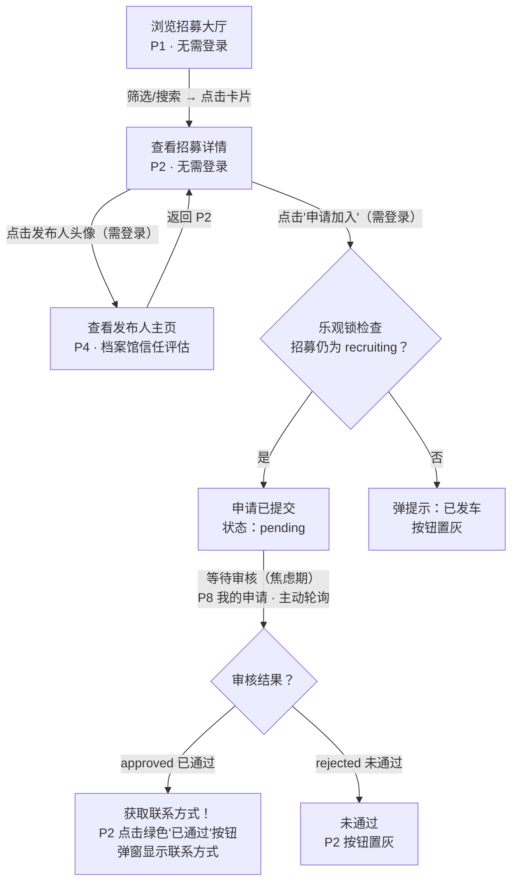

# 跑团组局小程序 · 产品需求文档（PRD）

> **版本：V1.3 页面逻辑完善版**
> **最后更新：2026 年 3 月 29 日**
> **基于版本：V1.2 架构复盘修订版（prd032402）**

---

## 目录

1. [基本信息](#1-基本信息)
2. [用户角色](#2-用户角色)
3. [登录与授权](#3-登录与授权)
4. [信息架构与全局导航](#4-信息架构与全局导航)
5. [MVP 页面全景清单](#5-mvp-页面全景清单)
6. [页面跳转关系](#6-页面跳转关系)
7. [权限矩阵](#7-权限矩阵)
8. [招募状态与申请状态联动](#8-招募状态与申请状态联动)
9. [页面结构详细定义](#9-页面结构详细定义)
10. [空状态定义](#10-空状态定义)
11. [用户旅程](#11-用户旅程)
12. [共用组件](#12-共用组件)
13. [数据结构（Mock Data）](#13-数据结构mock-data)
14. [技术规范](#14-技术规范)
15. [UI 设计规范](#15-ui-设计规范)
16. [V1.0 待办事项](#16-v10-待办事项)
17. [未来规划](#17-未来规划)

---

## 1. 基本信息

| 属性 | 内容 |
|---|---|
| 产品定位 | QQ 群跑团生态的高效率组局插件（非跑团工具本体） |
| 适用端 | 微信小程序 / QQ 小程序（双端互通） |
| 北极星指标 | 发布人完成一次招募发布的时间 < 10 秒 |
| 核心理念 | 极简，不改变玩家原有 QQ 群跑团习惯 |
| 技术栈 | uni-app + Vue3 + Vite + Pinia（JavaScript） |

---

## 2. 用户角色

### 2.1 发布人（GM 或 PL 均可）

核心诉求：快速发车，招募到靠谱的玩家。

**最高频动作：**

- 发布招募（极简表单，目标 10 秒内完成）
- 审批申请人：查看申请人列表 → 点击进入申请人主页 → 同意或拒绝
- 同意申请后：系统自动将联系方式展示给申请人（申请人主动查看）
- 手动点击「发车」按钮，将招募状态改为已发车

### 2.2 申请人（PL 或 GM）

核心诉求：快速找到符合时间和规则体系的车，顺利上车。

**最高频动作：**

- 浏览与筛选（在招募大厅中按 tag 找车）
- 查看发布人主页及档案馆，判断是否值得申请
- 报名上车（申请加入）
- 在「我的申请」中主动轮询查看审批结果
- 审批通过后：点击详情页底部按钮弹出发布人联系方式

---

## 3. 登录与授权

小程序**不设独立登录页面**，授权通过 `wx.login` 弹窗触发，封装在 `src/utils/auth.js` 的 `checkLogin()` 方法中。授权完成后继续执行被拦截的操作。

**核心原则：只有招募大厅（P1）浏览 和 招募详情页（P2）浏览+分享 不需要登录，其余所有页面和操作均需要登录。**

| 页面/操作 | 是否需要登录 |
|---|---|
| 浏览招募大厅（P1） | 否 |
| 使用 P1 筛选和搜索 | 否 |
| 查看招募详情页（P2）内容 | 否 |
| P2 点击分享图标 | 否 |
| P2 点击「申请加入」 | 是 |
| P2 点击发布人头像 → 用户主页 | 是 |
| 点击悬浮「+」发布按钮 | 是 |
| 进入 Tab2「我的」（P7） | 是 |
| 进入用户主页（P4） | 是 |
| 进入发布表单（P3） | 是 |
| 进入编辑个人资料（P5） | 是 |
| 进入演绎记录详情（P6） | 是 |
| 进入我的创建/申请/足迹（P8） | 是 |
| 进入发布人详情页（P9） | 是 |
| 进入审核页（P10） | 是 |

> MVP 阶段授权成功后注入 mockData 里的用户数据模拟登录态。

### 退出登录（MVP 实现）

- 入口：P7「我的」页面右上角设置图标
- 行为：清空 store 中的用户数据 → `switchTab` 回到 P1 招募大厅 → 恢复游客态
- 退出后用户可继续以游客身份浏览 P1 和 P2

---

## 4. 信息架构与全局导航

### 4.1 底部导航栏（TabBar）

底部 Tab Bar 共 **2 个**入口，发布功能改为悬浮圆形按钮：

| Tab | 页面 | 核心功能 |
|---|---|---|
| Tab 1 | 招募大厅（P1） | 浏览与筛选招募中的卡片，匿名可用 |
| Tab 2 | 我的（P7） | 个人主页（本人视角）、档案馆、我的创建/申请/足迹 |

**底部导航栏显示规则：只有 TabBar 页面（P1、P7）显示底部导航栏，所有子页面自动隐藏，这是微信的默认行为，不需要手动控制。**

### 4.2 悬浮发布按钮

- 固定在屏幕底部中央、TabBar 上方
- 圆形，直径 96rpx，背景色 #000000，白色「+」号
- 点击触发登录检查，已登录则跳转 `pages/publish/form`

### 4.3 页面栈与返回机制

微信小程序维护一个"页面栈"，可以理解成一摞扑克牌：

| 跳转方式 | 行为 | 使用场景 |
|---|---|---|
| `navigateTo` | 在栈顶加一张新牌（打开新页面） | 跳转普通子页面 |
| `navigateBack` | 拿走栈顶那张牌（返回上一页） | 点击返回按钮 |
| `switchTab` | 切换到 TabBar 页面，清空非 TabBar 的页面栈 | 切换底部 Tab |
| `redirectTo` | 替换栈顶那张牌（不增加栈深度） | 表单提交后跳转，避免返回空表单 |

> 本文档中所有"返回上一页"均指 `navigateBack()`，返回到哪个页面取决于用户从哪条路径走过来，不硬编码目标页面。

---

## 5. MVP 页面全景清单

MVP 共 **10 个页面**（含 2 个 TabBar 页面 + 8 个普通子页面）。

| 编号 | 页面路径 | 页面名称 | 页面类型 | 层级 | 一句话说明 |
|---|---|---|---|---|---|
| P1 | pages/home/index | 招募大厅 | TabBar（Tab1） | 一级 | 所有用户的首页，浏览招募中的卡片 |
| P2 | pages/home/detail | 招募详情页 | 子页面 | 二级 | 查看某条招募的完整信息，申请加入 |
| P3 | pages/publish/form | 发布/编辑表单 | 子页面 | 二级/三级 | 创建新招募或编辑已有招募 |
| P4 | pages/profile/index | 用户主页 | 子页面 | 二级/三级 | 查看某用户的个人信息和档案馆（含吸顶 tab） |
| P5 | pages/profile/edit | 编辑个人资料 | 子页面 | 二级 | 修改自己的昵称、性别、签名等 |
| P6 | pages/profile/log_detail | 演绎记录详情 | 子页面 | 二级/三级 | 查看或编辑一条演绎记录 |
| P7 | pages/mine/index | 我的 | TabBar（Tab2） | 一级 | Tab2 壳页面，渲染本人视角的用户主页 |
| P8 | pages/mine/created | 我的创建/申请/足迹 | 子页面 | 二级 | 三个 tab 视图共用一个页面 |
| P9 | pages/mine/detail | 发布人详情页 | 子页面 | 三级 | 发布人管理自己的招募（编辑/审核/发车） |
| P10 | pages/mine/review | 审核页 | 子页面 | 四级 | 发布人审批申请人（同意/拒绝） |

### 层级说明

- **一级页面**：TabBar 页面，底部导航栏直接可达（P1、P7）
- **二级页面**：从一级页面点击进入的子页面
- **三级页面**：从二级页面点击进入的子页面
- **四级页面**：从三级页面点击进入的子页面
- 同一个页面根据进入路径不同，可能处于不同层级（如 P3、P4、P6）

### 补充说明

- **P7 是 P4 本人视角的壳页面**：因微信 TabBar 页面不支持 URL 传参，P7 自动注入当前用户 uid，复用 P4 的组件逻辑，不独立维护 UI。
- **P3 不在 TabBar 中**：入口是悬浮「+」按钮，页面本身是普通子页面。
- **已废弃**：`pages/auth/login`（独立登录页），登录改为 wx.login 授权弹窗。

---

## 6. 页面跳转关系

### 6.1 从招募大厅（P1）出发

| 触发操作 | 目标页面 | 跳转方式 | 需要登录 |
|---|---|---|---|
| 点击招募卡片 | P2 招募详情页 | navigateTo(?id=xxx) | 否 |
| 点击悬浮「+」按钮 | P3 发布表单·新建模式 | navigateTo | 是 |
| 点击底部 Tab2 | P7 我的 | switchTab | 是 |

### 6.2 从招募详情页（P2）出发

| 触发操作 | 目标页面 | 跳转方式 | 需要登录 |
|---|---|---|---|
| 点击发布人头像/昵称 | P4 用户主页（他人视角） | navigateTo(?uid=xxx) | 是 |
| 点击「申请加入」（游客） | 留在当前页，弹授权窗 | — | 是 |
| 点击「已通过」按钮 | 留在当前页，弹联系方式窗 | — | — |
| 点击分享图标 | 微信分享面板 | onShareAppMessage | 否 |
| 点击「管理招募」链接（仅发布人本人可见） | P9 发布人详情页 | navigateTo(?id=xxx) | — |
| 点击返回 | 上一页（由页面栈决定） | navigateBack | — |

**微信分享落地页：** 用户将招募分享给微信好友后，好友在聊天中看到分享卡片，点击该卡片会打开小程序并直接进入 P2 招募详情页（携带该招募的 id 参数）。

### 6.3 从发布/编辑表单（P3）出发

| 触发操作 | 目标页面 | 跳转方式 | 备注 |
|---|---|---|---|
| 点击「发布」 | P8 我的创建 | **redirectTo**(?tab=created) | 弹「发出去喽」确认后跳转，替换栈顶 |
| 点击「保存草稿」 | P8 我的创建 | **redirectTo**(?tab=created) | 替换栈顶，避免返回空表单 |
| 返回键（已填模组名称） | 弹窗 → 保存草稿跳 P8（redirectTo）/ 不保存则 navigateBack | — | — |
| 返回键（未填名称有其他内容） | 弹窗 → 去填写留 P3 / 放弃则 navigateBack | — | — |
| 返回键（空表单） | 上一页 | navigateBack | 不弹窗 |

### 6.4 从用户主页（P4）/ 我的壳页面（P7）出发

P7 与 P4 本人视角完全相同，以下统一说明。

| 触发操作 | 可见性 | 目标页面 | 跳转方式 |
|---|---|---|---|
| 点击「编辑资料」按钮 | 仅本人 | P5 编辑个人资料 | navigateTo |
| 点击头像 | 仅本人 | P5 编辑个人资料 | navigateTo |
| 点击「我的创建」入口 | 仅本人 | P8(?tab=created) | navigateTo |
| 点击「我的申请」入口 | 仅本人 | P8(?tab=applied) | navigateTo |
| 点击「我的足迹」入口 | 仅本人 | — | Toast「即将开放」 |
| 点击「我的心愿」入口 | 仅本人 | — | Toast「即将开放」 |
| 点击档案馆·演绎记录缩略卡片 | 本人和他人 | P6 演绎记录详情 | navigateTo(?id=xxx) |
| 点击档案馆·演绎记录「+ 新增」 | 仅本人 | P6 演绎记录详情·新建模式 | navigateTo（无 id） |
| 点击档案馆·其他 tab 内容 | 本人和他人 | — | Toast「即将开放」 |
| 点击右上角「设置」图标 | 仅本人 | 退出登录确认弹窗 | 确认后清空 store → switchTab 回 P1 |
| 点击悬浮「+」按钮 | 本人和他人 | P3 发布表单·新建模式 | navigateTo |

### 6.5 从编辑个人资料（P5）出发

| 触发操作 | 目标页面 | 跳转方式 | 备注 |
|---|---|---|---|
| 保存成功 | P7（我的） | navigateBack | 只有本人能进入 P5，路径一定是 P7 → P5 |
| 点击返回 | P7（我的） | navigateBack | 同上 |

### 6.6 从演绎记录详情（P6）出发

| 触发操作 | 目标页面 | 跳转方式 | 备注 |
|---|---|---|---|
| 点击「保存」（编辑态，仅本人） | 留在当前页 | — | 切换回浏览态 |
| 点击返回 | 上一页（P4 或 P7） | navigateBack | 回到用户主页 |

### 6.7 从我的创建/申请/足迹（P8）出发

| 触发操作 | 当前 tab | 目标页面 | 跳转方式 |
|---|---|---|---|
| 点击卡片 | created（我的创建） | P9 发布人详情页 | navigateTo(?id=xxx) |
| 点击卡片 | applied（我的申请） | P2 招募详情页 | navigateTo(?id=xxx) |
| 点击右上角「+ 发布」 | created | P3 发布表单·新建模式 | navigateTo |
| 切换顶部 tab | 任意 | 留在当前页 | 页面内 tab 切换 |
| 点击返回 | 任意 | 上一页 | navigateBack |

### 6.8 从发布人详情页（P9）出发

| 触发操作 | 卡片状态 | 目标页面 | 跳转方式 |
|---|---|---|---|
| 点击「编辑」 | draft（草稿）或 recruiting（招募中） | P3 发布表单·编辑模式 | navigateTo(?id=xxx) |
| 点击「发布」 | draft（草稿） | 留在当前页 | 弹「发出去喽」确认，状态变为 recruiting（招募中） |
| 点击「审核」 | recruiting（招募中） | P10 审核页 | navigateTo(?id=xxx) |
| 点击「发车」 | recruiting（招募中） | P8 我的创建 | 弹确认窗，确认后 redirectTo(?tab=created) |
| 点击返回 | 任意 | 上一页（P8） | navigateBack |

### 6.9 从审核页（P10）出发

| 触发操作 | 目标页面 | 跳转方式 | 备注 |
|---|---|---|---|
| 点击申请人头像 | P4 用户主页（他人视角） | navigateTo(?uid=xxx) | 查看申请人档案 |
| 点击「同意」/「拒绝」 | 留在当前页 | — | 按钮替换为状态标签 |
| 点击返回 | P9 发布人详情页 | navigateBack | P9 通过 onShow 自动刷新 |

### 6.10 页面跳转简图

#### Tab1 分支

> 外部入口：微信分享卡片 → 直接打开 P2 招募详情页（带 id 参数）

#### Tab2 分支

---

## 7. 权限矩阵

### 7.1 全局操作

| 操作 | 游客 | 已登录用户 |
|---|---|---|
| 浏览招募大厅（P1） | ✅ | ✅ |
| 使用筛选/搜索 | ✅ | ✅ |
| 查看招募详情（P2）内容 | ✅ | ✅ |
| P2 微信原生分享 | ✅ | ✅ |
| P2 点击「申请加入」 | 🔒 弹授权 | ✅ |
| P2 点击发布人头像 | 🔒 弹授权 | ✅ |
| 点击悬浮「+」发布按钮 | 🔒 弹授权 | ✅ |
| 进入 Tab2「我的」 | 🔒 弹授权 | ✅ |
| 进入其他所有页面（P3-P10） | 🔒 弹授权 | ✅ |

### 7.2 招募详情页（P2）操作

| 操作 | 游客 | 已登录·非发布人·未申请 | 已登录·非发布人·已申请 | 已登录·发布人本人 |
|---|---|---|---|---|
| 浏览招募内容 | ✅ | ✅ | ✅ | ✅ |
| 点击「申请加入」 | 🔒 弹授权 | ✅ 提交申请 | ❌ 按钮显示对应状态 | ❌ 灰色不可点，弹提示 |
| 查看联系方式弹窗 | ❌ | ❌ | ✅（仅 approved 已通过） | ❌ |
| 点击发布人头像 | 🔒 弹授权 | ✅ | ✅ | ✅（跳自己主页） |
| 看到「管理招募」链接 | ❌ | ❌ | ❌ | ✅ |
| 点击分享 | ✅ | ✅ | ✅ | ✅ |

### 7.3 发布与管理操作

| 操作 | 游客 | 已登录·非发布人 | 已登录·发布人本人 |
|---|---|---|---|
| 创建新招募（P3 新建模式） | 🔒 | ✅ | ✅ |
| 编辑已有招募（P3 编辑模式） | ❌ | ❌ | ✅（编辑不影响已有申请，已知限制） |
| 查看发布人详情页（P9） | ❌ | ❌ | ✅ |
| 进入审核页（P10） | ❌ | ❌ | ✅（仅 recruiting 招募中状态） |
| 审批申请人 | ❌ | ❌ | ✅（通过人数不受招募人数限制） |
| 发车操作 | ❌ | ❌ | ✅（仅 recruiting 招募中状态） |
| 保存草稿 | 🔒 | ✅ | ✅ |

### 7.4 用户主页与档案馆操作

| 操作 | 游客 | 已登录·查看他人 | 已登录·查看自己 |
|---|---|---|---|
| 查看个人信息 | ❌ | ✅ | ✅ |
| 查看档案馆·演绎记录缩略卡片 | ❌ | ✅ | ✅ |
| 点击进入演绎记录详情（P6） | ❌ | ✅（只读） | ✅（可编辑） |
| 新增演绎记录 | ❌ | ❌ | ✅ |
| 编辑/保存演绎记录 | ❌ | ❌ | ✅ |
| 编辑个人资料（P5） | ❌ | ❌ | ✅ |
| 查看快捷入口 | ❌ | ❌ | ✅ |
| 查看关注/粉丝/获赞 | ❌ | ✅（占位，值为 0） | ✅（占位，值为 0） |

---

## 8. 招募状态与申请状态联动

### 8.1 招募状态流转

| 状态 | 触发条件 | 可执行操作 |
|---|---|---|
| draft（草稿） | 发布人点「保存草稿」 | 编辑、发布（→ recruiting） |
| recruiting（招募中） | 发布人点「发布」确认 | 编辑、审核、发车（→ finished） |
| finished（已发车） | 发布人手动点「发车」并确认 | 仅只读，不可逆 |

> **发车联动规则：** 发布人点击「发车」确认后，系统自动将所有仍处于 `pending`（审核中）状态的申请统一标记为 `rejected`（未通过）。发布人无需手动逐一拒绝。

> 架构备注：状态字段为 `status`（string），预留未来在「我的创建」列表顶部增加 Tab 筛选（全部 / 招募中 / 草稿 / 已发车）。

### 8.2 申请状态流转

> cancelled（已取消）为 MVP 预留字段，暂不实现。

### 8.3 「我的申请」卡片显示（申请状态 × 招募状态）

| 申请状态 | 招募 recruiting（招募中）时 | 招募 finished（已发车）后 |
|---|---|---|
| pending（审核中） | 审核中 | （已归并为 rejected）→ 未通过 · 已发车 |
| approved（已通过） | ✓ 已通过 | ✓ 已通过 · 已发车 |
| rejected（未通过） | 未通过 | 未通过 · 已发车 |

### 8.4 招募详情页（P2）底部按钮完整状态表

| 招募状态 | 访问者身份 | 申请状态 | 按钮文字 | 可点击 | 点击行为 |
|---|---|---|---|---|---|
| recruiting（招募中） | 游客 | — | 申请加入 | ✅ | 触发授权弹窗 |
| recruiting（招募中） | 已登录他人 | 无申请 | 申请加入 | ✅ | 乐观锁检查 → 提交申请 |
| recruiting（招募中） | 已登录他人 | pending（审核中） | 等候审核中 | ❌ | — |
| recruiting（招募中） | 已登录他人 | approved（已通过） | 已通过 | ✅ | 弹联系方式弹窗 |
| recruiting（招募中） | 已登录他人 | rejected（未通过） | 未通过 | ❌ | — |
| recruiting（招募中） | 发布人本人 | — | 申请加入 | ❌ | 弹提示「你是本次招募的发布人，无法申请」 |
| finished（已发车） | 已登录他人 | approved（已通过） | ✓ 已通过 · 已发车 | ✅ | 弹联系方式弹窗（发车后仍可查看） |
| finished（已发车） | 其他所有人 | — | 已发车 | ❌ | — |

> 说明：用户申请过一次后（无论审核结果如何），再次进入同一条招募的 P2 详情页时，底部按钮直接显示对应的申请状态，不可再次申请。

---

## 9. 页面结构详细定义

### 9.1 招募大厅 `pages/home/index.vue`

**重要规则：只展示 status = recruiting 的卡片，已发车卡片不在此页出现。**

**数据刷新规则：页面每次 `onShow` 时重新读取一次数据，确保发车后的卡片及时从列表消失。**

**排序规则：MVP 不做排序，按数据原始顺序展示。**

**筛选状态保留：用户离开 P1 再返回时，筛选条件保留不重置。**

#### 筛选栏（吸顶，横向滚动）

| 筛选维度 | 选项 |
|---|---|
| 规则体系 | COC / DND / 其他（非 COC/DND 均归入「其他」） |
| 招募对象 | KP / PL / DM |
| 跑团方式 | 语音 / 文字 |

#### 搜索框

按模组名称搜索，按回车或点搜索按钮触发，不做实时搜索。搜索框放在页面内容区顶部，不放在导航栏区域。

#### 招募卡片内容

| 元素 | 说明 |
|---|---|
| 封面图 | 100×100rpx，圆角 10rpx，无图则显示占位色块 #d9d9d9 |
| 模组名称 | 粗体，36rpx，主标题 |
| Tag 行 | 跑团方式 / 规则体系 / 招募人数 |
| 信息行一 | 预计时长 │ 招募对象 |
| 信息行二 | 跑团时间 │ 招募人 ID（右对齐，#b2b2b2） |
| 右下角人数 | 招募中状态显示「X 人申请」；已发车状态不显示人数 |

---

### 9.2 招募详情页 `pages/home/detail.vue`

**所有人进入此页面均显示申请人视角，包括发布人本人。**

**数据刷新规则：页面每次 `onShow` 时重新读取一次数据。**

#### 页面结构（从上到下）

- 顶部导航栏：模组名称（居中）+ 返回按钮
- 页面内容区右上角：分享图标（圆形占位色块 #666666，32×32rpx，位于页面内容区内，不得进入导航栏区域）
- 封面图（100×100rpx）+ 发布人头像/昵称 → 点击触发登录后跳转用户主页
- Tag 行：跑团方式 / 规则体系 / 人数
- 信息行：预计时长 / 招募对象 / 跑团时间
- 分割线 + 「模组简介」标题
- 简介正文（长文，支持长按复制）
- **发布人本人视角专属**：内容区某处显示「管理招募」文字链接，点击跳转 `pages/mine/detail?id=xxx`
- 底部吸底按钮（状态见第 8.4 章完整状态表）

#### 申请时的状态检查（乐观锁）

用户点击「申请加入」时，系统先确认该卡片当前状态：
- 仍为 `recruiting`：正常提交申请
- 已变为 `finished`：弹提示「该招募已发车，无法申请」，底部按钮同步变为灰色「已发车」

#### 分享功能

点击分享图标调用微信原生分享（`onShareAppMessage`），分享标题为模组名称，分享内容为模组简介。MVP 只做原生转发，图片二维码生成留后端接入后实现。分享卡片点击后直接打开 P2 招募详情页（带 id 参数）。

#### 联系方式弹窗

- 标题：你已通过审核
- 内容：发布人预设的联系方式（微信号 / QQ 号 / QQ 群号 + 具体号码）
- 按钮：我知道了（关闭弹窗）
- 弹窗可反复打开，无次数限制

> 联系方式**只在此弹窗里展示**，不在任何列表卡片上直接显示，保护发布人隐私。

---

### 9.3 发布 / 编辑表单 `pages/publish/form.vue`

**此页面为普通子页面，不在 TabBar 中，有原生返回箭头。**

三个入口均跳转此页面：
- 悬浮「+」按钮 → 新建模式（无 id 参数）
- 「我的创建」右上角「+发布」按钮 → 新建模式
- 发布人详情页「编辑」按钮 → 编辑模式（带 id 参数，所有字段回填）

提交后使用 `redirectTo` 跳转至 `pages/mine/created?tab=created`（替换栈顶，避免用户返回空表单）。

#### 新建模式 vs 编辑模式

| 模式 | 触发条件 | 字段状态 | 联系方式字段 |
|---|---|---|---|
| 新建 | 无 id 参数 | 全部空白 | 空白，用户手动填写 |
| 编辑 | 有 id 参数 | 全部回填原有内容 | 回填上次填写的值 |

#### 表单字段

| 字段 | 类型 | 必填 | 说明 |
|---|---|---|---|
| 模组封面 | 图片上传 | 否 | 占位色块，未来支持上传 |
| 模组名称 | 文字输入 | 是 | 不超过 20 字；旁边预留「导入模组信息」按钮（MVP 点击显示「即将开放」） |
| 预计时长 | 时间选择器 | 是 | 1 小时 ~ 99 小时 |
| 跑团时间 | 时间选择器 | 是 | 开始-结束时间 |
| 跑团规则 | 单选 | 是 | COC6th / COC7th / DND5E / FATE / Pathfinder / 其他 |
| 跑团方式 | 单选 | 是 | 语音 / 文字 |
| 跑团人数 | 数字输入 | 是 | 总人数 |
| 招募 PL | 数字输入 | 否 | 缩进子项 |
| 招募 KP/DM | Toggle 开关 | 否 | 缩进子项 |
| 模组简介 | 多行文本 | 否 | 不超过 300 字 |
| 邀请方式 | 单选 + 文本输入 | 是 | 微信号 / QQ 号 / QQ 群号，三选一；提示文案：「审核通过后将自动发送给申请人」 |

#### 底部按钮

两个并排吸底按钮，高度 88rpx，圆角 16rpx，间距 16rpx：

| 按钮 | 样式 | 行为 |
|---|---|---|
| 保存草稿 | 浅色次按钮 | 以 draft 状态存入 store，redirectTo 跳转「我的创建」 |
| 发布 | 深色主按钮 | 弹提示「发出去喽」确认，以 recruiting 状态存入 store，redirectTo 跳转「我的创建」 |

#### 返回键行为（新建模式）

| 情况 | 返回键触发 | 弹窗内容 | 按钮一 | 按钮二 |
|---|---|---|---|---|
| 模组名称已填 | 弹确认窗 | 「是否保存为草稿？」 | 保存草稿（redirectTo 跳我的创建） | 不保存（直接返回，不生成卡片） |
| 模组名称未填，但填了其他内容 | 弹提示窗 | 「至少填写模组名称才能保存草稿」 | 去填写（留在表单） | 放弃（直接返回，不保存） |
| 什么都没填 | 直接返回 | 不弹窗 | — | — |

> 编辑模式下返回键行为与新建模式相同，以模组名称是否存在为判断基础（编辑模式下名称必然已填，因此返回必触发弹窗）。

> 点击「发布」直接上线，不设预览环节，符合北极星指标「发布时间 < 10 秒」。
> 页面底部内容区需留足 padding-bottom（400rpx），确保最后一个表单项与吸底按钮之间有足够留白。

---

### 9.4 用户主页 `pages/profile/index.vue`

通过 `uid` 参数区分本人/他人。`pages/mine/index`（Tab2）作为壳页面，自动读取当前登录用户 uid，渲染与本人视角完全相同的内容。

#### 页面结构（四层吸顶布局）

| 层级 | 内容 | 滚动行为 |
|---|---|---|
| 第一层 | 个人信息区（头像、昵称、UID、性别、身份 tag、签名、关注/粉丝/获赞） | 正常跟随滚动，滚出屏幕顶部后隐藏 |
| 第二层 | 快捷入口四格（我的创建/申请/足迹/心愿），仅本人视角显示 | 正常跟随滚动，滚出屏幕顶部后隐藏 |
| 第三层 | 档案馆 tab 栏（演绎记录 / 属性面板 / 人物卡 / 跑团饭） | **`position: sticky; top: 0`，吸顶固定** |
| 第四层 | 当前 tab 的内容区（展示该 tab 下的全部内容） | 正常滚动 |

> 效果类似小红书个人主页：用户往下滑动时，个人信息和快捷入口自然滚出屏幕，档案馆 tab 栏到达顶部后"粘住"不动，下方内容在 tab 栏下方继续滚动。

#### 个人信息区

| 元素 | 本人视角 | 他人视角 |
|---|---|---|
| 头像 | 显示，点击可进入编辑页 | 显示，只读 |
| 昵称 | 显示 | 显示 |
| UID | 显示 | 显示 |
| 性别 | 显示 | 显示 |
| 身份 tag | KP / PL / DM，显示 | 显示 |
| 个性签名 | 显示 | 显示 |
| 关注 / 粉丝 / 获赞 | 占位显示（值为 0），不可点 | 占位显示，不可点 |
| 「编辑资料」按钮 | 显示，跳转编辑页 | 不显示 |
| 右上角「设置」图标 | 显示，点击触发退出登录 | 不显示 |

#### 快捷入口（四格，仅本人视角显示）

| 入口 | 跳转目标 | MVP 状态 |
|---|---|---|
| 我的创建 | pages/mine/created?tab=created | 可用 |
| 我的申请 | pages/mine/created?tab=applied | 可用 |
| 我的足迹 | pages/mine/created?tab=history | 占位，Toast「即将开放」，MVP 不做 |
| 我的心愿 | — | 占位，Toast「即将开放」 |

#### 档案馆（吸顶 tab + 内容区）

- 档案馆 tab 栏使用 `position: sticky; top: 0` 实现吸顶。
- 切换 tab 时，内容区替换为对应模块的内容。
- **演绎记录 tab**：展示所有记录的缩略卡片，不做截断，全部展示。缩略卡片内容：标题 + 模组名称 tag + 其他 tag + 正文前两行预览 + 日期。点击某条 → navigateTo 跳转 P6 详情页。本人视角底部显示「+ 新增」按钮。
- **属性面板 / 人物卡 / 跑团饭**：MVP 占位，显示「即将开放」。
- **不新增独立的档案馆页面**，主页吸顶 tab 已涵盖全部功能。

---

### 9.5 演绎记录详情页 `pages/profile/log_detail.vue`

同一页面承担查看和编辑两种模式。他人访问为纯只读，无操作按钮。

#### 编辑态字段

| 字段 | 类型 | 必填 | 说明 |
|---|---|---|---|
| 标题 | 单行文本 | 是 | |
| 模组名称 | 单行文本，自由输入 | 是 | 浏览态降格为 tag 与其他 tag 并排展示 |
| tag | 预设列表 + 自定义输入，多选 | 否 | 预设如：COC / DND / 语音团 / 文字团等 |
| 正文 | 多行长文本 | 是 | 支持直接粘贴长文字 log |

#### 双态切换规则

| 访问者 | 交互规则 |
|---|---|
| 他人访问 | 纯浏览态，无任何操作按钮 |
| 本人 - 浏览态 | 右上角「编辑」按钮，点击切换为编辑态 |
| 本人 - 编辑态 | 右上角「保存」按钮，保存后返回浏览态 |

---

### 9.6 我的创建 / 申请 / 足迹 `pages/mine/created.vue`

同一个页面承担三个入口，通过 URL 参数 `tab` 区分。

#### 三个 tab 的本质

| Tab | 本质 | MVP 状态 |
|---|---|---|
| 我的创建（created） | 我发布的招募（含草稿/招募中/已发车） | 真实可用 |
| 我的申请（applied） | 我提交过申请的全部招募 | 真实可用 |
| 我的足迹（history） | 我浏览过的招募 | 占位，Toast「即将开放」 |

#### Tab 视图跳转逻辑

| tab 参数 | 卡片点击跳转 |
|---|---|
| created | pages/mine/detail?id=xxx（发布人详情页） |
| applied | pages/home/detail?id=xxx（申请人视角详情页） |
| history | MVP 不做 |

#### 「我的创建」卡片

- 草稿卡片：模组名称前显示**「（草稿）」**前缀，与名称同行同样式
- 招募中卡片：右下角显示「X 人申请」（#b2b2b2）
- 已发车卡片：右下角不显示人数

#### 「我的申请」卡片右下角状态

**发车前：**

| 申请状态 | 标签文字 | 文字颜色 | 背景色 |
|---|---|---|---|
| pending（审核中） | 审核中 | #888888 | #f0f0f0 |
| approved（已通过） | ✓ 已通过 | #2a7a4a | #e8f5ee |
| rejected（未通过） | 未通过 | #666666 | #e8e8e8 |

**发车后（审核状态与发车状态并列显示）：**

| 申请人原审核状态 | 发车后显示 | 文字颜色 | 背景色 |
|---|---|---|---|
| approved（已通过） | ✓ 已通过 · 已发车 | #2a7a4a | #e8f5ee |
| pending 或 rejected | 未通过 · 已发车 | #666666 | #e8e8e8 |

> 发车时系统自动将所有 pending 状态归并为 rejected，因此发车后申请人只会看到「已通过·已发车」或「未通过·已发车」两种状态。

---

### 9.7 发布人详情页 `pages/mine/detail.vue`

**数据刷新规则：页面每次 `onShow` 时重新读取一次数据，确保从审核页返回后数据自动更新。**

#### 底部按钮随状态变化

| 卡片状态 | 底部按钮 | 操作说明 |
|---|---|---|
| draft（草稿） | 编辑 / 发布 | 编辑→存 store id 后跳 form；发布→弹「发出去喽」确认，状态变 recruiting |
| recruiting（招募中） | 编辑 / 审核 / 发车 | 审核→跳 pages/mine/review；发车→弹确认窗 |
| finished（已发车） | 已发车（灰色，不可点） | 页面只读 |

#### 发车确认弹窗

内容：「当前已通过 X 人，发车后招募将关闭，未处理的申请将自动标记为未通过，确认发车？」
按钮：确认发车 / 取消

发车成功后使用 `redirectTo` 跳转至 `pages/mine/created?tab=created`。

---

### 9.8 审核页 `pages/mine/review.vue`

从发布人详情页点击「审核」跳转进入。仅发布人本人可访问。

- 列表条目：头像（点击跳用户主页）/ 昵称 / 申请时间 / 同意·拒绝按钮
- 同意后：替换为「已通过」绿色标签；拒绝后：替换为「已拒绝」灰色标签
- MVP 不做推送通知，申请人主动轮询
- 返回后 `mine/detail` 页面通过 `onShow` 自动刷新数据

---

### 9.9 编辑个人资料 `pages/profile/edit.vue`

| 字段 | 类型 | 必填 | 说明 |
|---|---|---|---|
| 头像 | 图片上传 | 否 | MVP 占位色块 |
| 昵称 | 单行文本 | 是 | |
| UID | 只读展示 | — | 系统生成，不可修改 |
| 性别 | 单选 | 否 | 男 / 女 / 保密 |
| 身份 tag | 多选 | 否 | KP / PL / DM |
| 个性签名 | 多行文本 | 否 | |
| QQ 号 | 数字输入 | 否 | 存入个人资料备用 |

---

## 10. 空状态定义

| 页面/区域 | 空状态触发条件 | 显示文案 |
|---|---|---|
| P1 招募大厅 | 无任何 recruiting 状态的招募 | 暂无招募，快去发布第一个吧 |
| P1 筛选后 | 筛选结果为空 | 没有找到符合条件的招募 |
| P8 我的创建 tab | 用户未发布过任何招募 | 还没有发布过招募 |
| P8 我的申请 tab | 用户未申请过任何招募 | 还没有申请过招募 |
| P10 审核页 | 该招募无人申请 | 暂无申请，分享招募让更多人看到吧 |
| P4/P7 档案馆·演绎记录 tab | 用户无演绎记录 | 还没有演绎记录（本人视角额外显示「+ 新增」按钮） |

---

## 11. 用户旅程

### 11.1 发布人旅程：从想法到发车

| 阶段 | 情绪 | 说明 |
|---|---|---|
| 打开 → 填表单 | 顺畅 | 极简流程，10 秒完成 |
| 保存 or 发布 | 犹豫 | 信息填完了吗？要不要先存草稿？ |
| 等待申请 | 焦虑 | 有没有人来？需不需要去分享？ |
| 审批申请人 | 投入 | 这个人靠谱吗？看看档案馆 |
| 发车 | 满足 | 人齐了，出发！ |

### 11.2 申请人旅程：从浏览到上车

| 阶段 | 情绪 | 说明 |
|---|---|---|
| 浏览大厅 | 随意 | 随便看看有没有合适的车 |
| 查看详情 + 档案馆 | 好奇 | 这个 KP 靠谱吗？看看 ta 的跑团记录 |
| 点击申请 | 期待 | 希望能上车 |
| 等待审核 | 焦虑 | 会通过吗？什么时候出结果？ |
| 收到结果 | 释然或失望 | 通过了就拿联系方式，没通过就继续找 |

---

## 12. 共用组件

### `components/ModuleDetail.vue`

供发布人详情页和申请人详情页复用，包含：模组封面图 + 发起人信息 / Tag 行 / 信息行 / 分割线 + 简介。

⚠️ 必须单根节点，样式只允许 class 选择器。

### `components/FloatBtn.vue`

悬浮发布按钮，固定在屏幕底部中央 TabBar 上方。

- `position: fixed`，`bottom: 0`，`left: 50%`，`transform: translateX(-50%)`，`margin-bottom: 8rpx`
- 圆形，直径 96rpx，背景 #000000，白色「+」，字号 48rpx
- 点击调用 `checkLogin()`，已登录跳转 `pages/publish/form`

---

## 13. 数据结构（Mock Data）

### 13.1 招募模组 Module

| 字段 | 类型 | 说明 |
|---|---|---|
| id | Number | 模组唯一标识 |
| title | String | 模组名称 |
| status | String | draft / recruiting / finished |
| rule | String | COC6th / COC7th / DND5E / FATE / Pathfinder / 其他 |
| mode | String | 语音 / 文字 |
| duration | String | 预计时长 |
| time | String | 跑团时间 |
| playerCount | Number | 招募总人数 |
| recruitPL | Number | 招募 PL 人数 |
| recruitKP | Boolean | 是否招募 KP/DM |
| intro | String | 模组简介 |
| contact | Object | `{ type: "qq"｜"wx"｜"qqgroup", value: "号码" }` |
| applyCount | Number | 申请人数（含所有状态） |
| creatorId | String | 发布人 UID |
| coverImage | String | 封面图 URL，无则为空 |

### 13.2 用户 User

| 字段 | 类型 | 说明 |
|---|---|---|
| uid | String | 用户唯一标识 |
| nickname | String | 昵称 |
| avatar | String | 头像 URL |
| gender | String | male / female / secret |
| tags | Array | 身份 tag，如 `["KP","PL"]` |
| signature | String | 个性签名 |
| qq | String | QQ 号（选填） |
| followCount | Number | 关注数（MVP 返回 0） |
| fansCount | Number | 粉丝数（MVP 返回 0） |
| likeCount | Number | 获赞数（MVP 返回 0） |

### 13.3 申请记录 Application

| 字段 | 类型 | 说明 |
|---|---|---|
| id | Number | 申请唯一标识 |
| moduleId | Number | 关联模组 ID |
| applicantId | String | 申请人 UID |
| status | String | pending / approved / rejected / cancelled（预留） |
| createdAt | String | 申请时间 |

### 13.4 演绎记录 Log

| 字段 | 类型 | 说明 |
|---|---|---|
| id | Number | 记录唯一标识 |
| authorId | String | 作者 UID |
| title | String | 标题 |
| moduleName | String | 模组名称（自由输入） |
| tags | Array | 标签列表 |
| content | String | 正文全文 |
| createdAt | String | 创建时间 |

---

## 14. 技术规范

### 14.1 页面跳转规范

| 场景 | 正确写法 | 说明 |
|---|---|---|
| 跳转 TabBar 页面 | `uni.switchTab({ url: ... })` | 不能用 navigateTo |
| 跳转普通页面 | `uni.navigateTo({ url: ... })` | — |
| 返回上一页 | `uni.navigateBack()` | 返回页面栈的上一页 |
| 表单提交后跳转 | `uni.redirectTo({ url: ... })` | 替换栈顶，避免返回空表单 |

> 发布表单（`pages/publish/form`）是普通子页面，发布/保存成功后使用 `redirectTo` 跳转，不用 `navigateTo`。

### 14.2 数据刷新规范

所有涉及状态变更的页面，必须在 `onShow` 生命周期钩子中重新读取数据：

| 页面 | 原因 |
|---|---|
| pages/home/index | 发车后大厅卡片需消失 |
| pages/home/detail | 发车后底部按钮需同步锁定 |
| pages/mine/detail | 审核页返回后申请人数需更新 |

### 14.3 微信小程序 CSS 规范

- 组件样式只允许 class 选择器，禁止标签选择器、ID 选择器、属性选择器
- 组件必须单根节点，不支持 fragment
- 禁止使用 CSS 通配符 `*`
- 禁止使用 `vh` / `vw` 单位，改用 `%` 或 `rpx`
- 所有尺寸单位统一使用 `rpx`

### 14.4 图片资源规范

- 禁止引用 `/static/` 目录下不存在的本地图片
- 所有图片占位一律使用背景色块（`#d9d9d9`）代替

### 14.5 导航栏规范

- 所有页面统一使用微信原生默认导航栏，禁止自定义导航栏
- `pages.json` 中每个页面只配置 `navigationBarTitleText`，禁止设置 `navigationBarBackgroundColor`、`navigationBarTextStyle`、`navigationStyle: custom`
- 原生导航栏自动处理顶部安全区域，页面内容区禁止手动加 `padding-top`
- 导航栏右上角为微信系统胶囊区域，**禁止放置任何自定义按钮**
- 所有自定义按钮必须放在页面内容区域内

### 14.6 登录规范

- 不设独立登录页，授权通过 `wx.login` 弹窗触发
- 所有需要登录的操作统一调用 `src/utils/auth.js` 里的 `checkLogin()` 方法
- 游客可自由浏览招募大厅和招募详情页（含分享功能）
- MVP 阶段授权成功后注入 mockData 里的用户数据模拟登录态

### 14.7 档案馆吸顶规范

- 用户主页（P4 / P7）的档案馆 tab 栏使用 `position: sticky; top: 0` 实现吸顶
- 此规则需同步写入 CLAUDE.md 作为 CC 实现规则

---

## 15. UI 设计规范

### 15.1 颜色系统

| 用途 | 颜色值 |
|---|---|
| 页面背景 | #f5f5f5 |
| 导航栏背景 | #2c2c2c |
| 底部 TabBar 背景 | #e6e6e6 |
| 卡片背景 | #e8e8e8 |
| 已发车蒙层 | rgba(0,0,0,0.5) |
| Tag 背景 | #434343 |
| Tag 文字 | #ffffff |
| 主标题文字 | #000000 |
| 正文信息文字 | #363636 |
| 辅助信息文字 | #b2b2b2 |
| 输入框边框 | #d9d9d9 |
| 图片/头像占位 | #d9d9d9 |
| 图标占位色块 | #666666 |
| 申请已通过文字 | #2a7a4a |
| 申请已通过背景 | #e8f5ee |
| 申请审核中文字 | #888888 |
| 申请审核中背景 | #f0f0f0 |
| 申请未通过文字 | #666666 |
| 申请未通过背景 | #e8e8e8 |

> ⚠️ 严格遵守以上色彩规范，禁止出现规范外颜色（如 #ff6b35、#6B3FA0、#1989fa 等）。所有颜色统一在 `uni.scss` 中以变量管理。

### 15.2 间距与尺寸

| 元素 | 规格 |
|---|---|
| 页面左右内边距 | 32rpx |
| 卡片内边距 | 上下 16rpx，左右 32rpx |
| 卡片圆角 | 16rpx |
| 卡片间距 | 8rpx |
| 封面图尺寸 | 100rpx × 100rpx，圆角 10rpx |
| Tag 高度 | 32rpx，左右 padding 16rpx，圆角 999rpx |
| 搜索栏高度 | 64rpx，圆角 999rpx |
| 图标占位色块 | 32rpx × 32rpx，圆角 50% |
| 底部按钮高度 | 88rpx，圆角 16rpx |
| 悬浮发布按钮直径 | 96rpx |

### 15.3 字体规范

| 元素 | 字号 | 字重 |
|---|---|---|
| 模组名称（主标题） | 36rpx | 粗体 |
| Tag 文字 | 22rpx | Normal |
| 卡片信息行文字 | 22rpx | Regular |
| 辅助信息（招募人 ID 等） | 22rpx | Regular，颜色 #b2b2b2 |
| 表单标签文字 | 28rpx | Regular |

---

## 16. V1.0 待办事项

| 优先级 | 功能 | 状态 |
|---|---|---|
| 高 | pages/mine/index 改为壳页面，与 profile/index 共用组件逻辑 | 待开发 |
| 高 | pages/home/detail 增加发布人本人「管理招募」入口 | 待开发 |
| 高 | pages/home/detail 底部按钮增加发布人本人灰色不可点态 | 待开发 |
| 高 | pages/home/detail 底部按钮增加 finished 状态下 approved 用户仍可查看联系方式 | 待开发 |
| 高 | 发布表单编辑模式全字段回填（含联系方式） | 待开发 |
| 高 | 发布表单返回键三种情况弹窗逻辑 | 待开发 |
| 高 | 发布表单发布/保存后使用 redirectTo 跳转 | 待开发 |
| 高 | P9 草稿状态「发布」按钮弹「发出去喽」确认 | 待开发 |
| 高 | 发车时自动将 pending 申请归并为 rejected | 待开发 |
| 高 | 「我的申请」卡片增加发车后「已通过·已发车」/「未通过·已发车」状态 | 待开发 |
| 高 | 申请时增加状态检查（乐观锁），已发车则弹提示锁定按钮 | 待开发 |
| 高 | home/index、home/detail、mine/detail 增加 onShow 刷新 | 待开发 |
| 高 | 登录游客/登录态两种闭环测试通畅 | 待开发 |
| 高 | 退出登录功能：清空 store → switchTab 回 P1 | 待开发 |
| 高 | 我的主页 UI 细节对齐原型图 | 待开发 |
| 高 | 用户主页档案馆 tab 吸顶实现（position: sticky） | 待开发 |
| 高 | 演绎记录缩略卡片展示（标题+tag+正文前两行+日期） | 待开发 |
| 高 | 审核页（发布人查看申请人列表并审批） | 待开发 |
| 高 | 审核页空状态文案 | 待开发 |
| 高 | 演绎记录上传与展示 | 待开发 |
| 高 | 各页面空状态定义（见第 10 章） | 待开发 |
| 中 | 后端接口接入，替换 mock 数据 | 待开发 |
| 中 | GitHub 上传，多人协作配置 | 待配置 |
| 低 | ICP 备案 + 公司注册（上架前） | 待办 |

---

## 17. 未来规划

| 版本 | 功能 |
|---|---|
| V1.1 | 后端接口接入 |
| V1.1 | 导入模组信息（D 站/魔都爬取，自动填充模组名称+简介） |
| V1.1 | 详情页分享图片二维码生成 |
| V1.1 | 档案馆 - 属性面板（跑团年限、擅长规则体系、角色偏好） |
| V1.1 | 我的足迹（浏览历史记录） |
| V1.1 | P1 卡片排序（最新发布优先 / 开团时间最近优先） |
| V1.2 | 档案馆 - 人物卡展示 |
| V1.2 | 演绎记录 - 语音团录音上传 |
| V2.0 | 社交功能：关注/粉丝/点赞 |
| V2.0 | 我的心愿（待定义） |
| V2.0 | 设置页（权限管理） |
| V2.0 | 推送通知（申请人收到审核结果、发布人收到新申请） |

---

*最后更新：2026 年 3 月 29 日 | 版本：V1.3 页面逻辑完善版（基于 prd032402 + 页面逻辑梳理 v3）*
