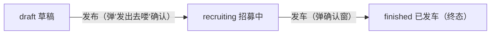
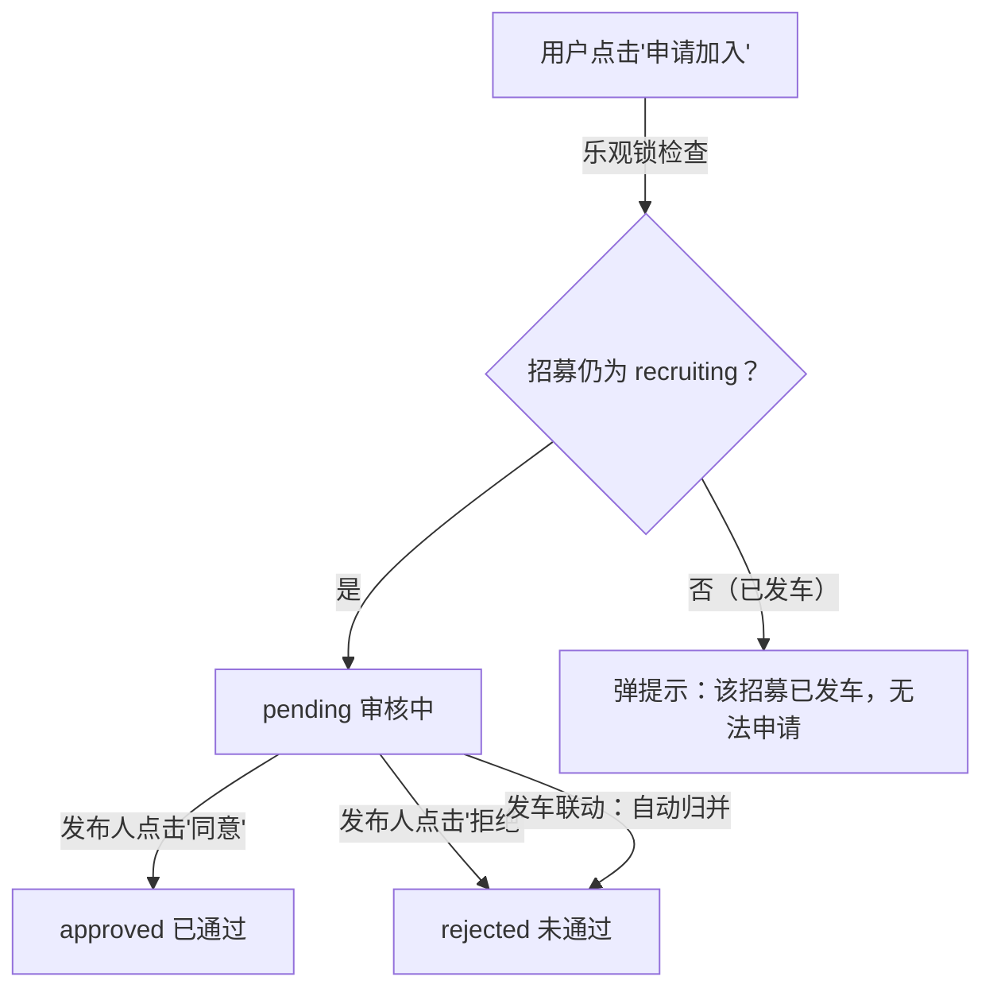
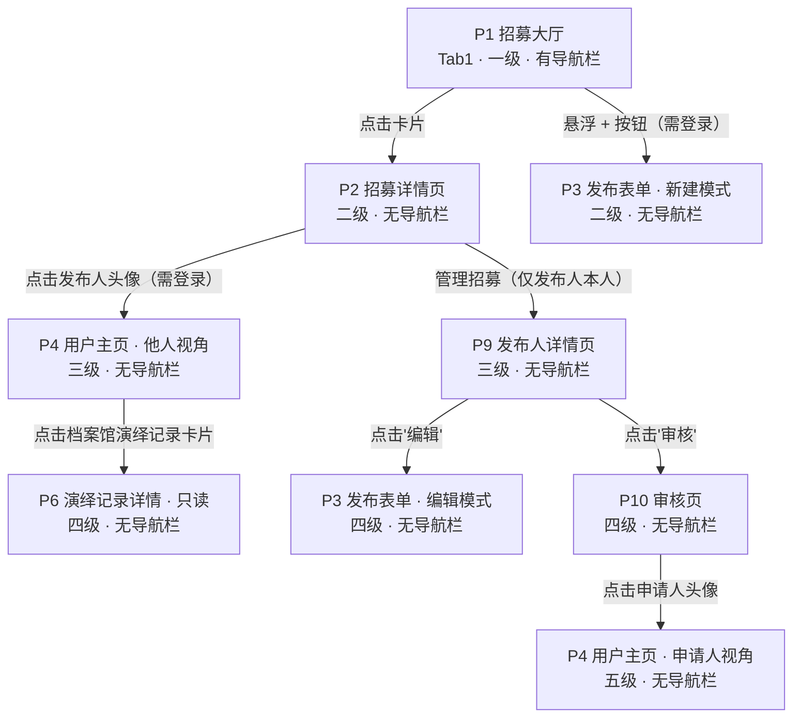
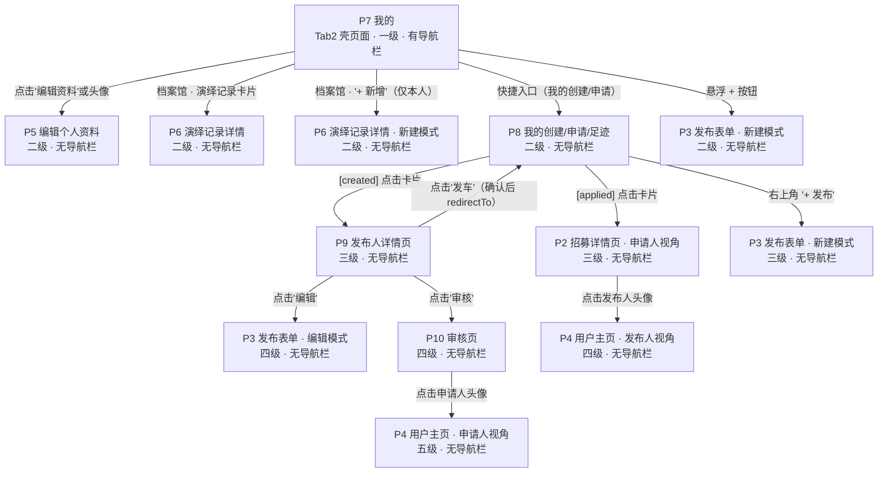
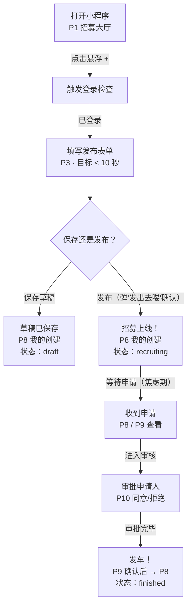
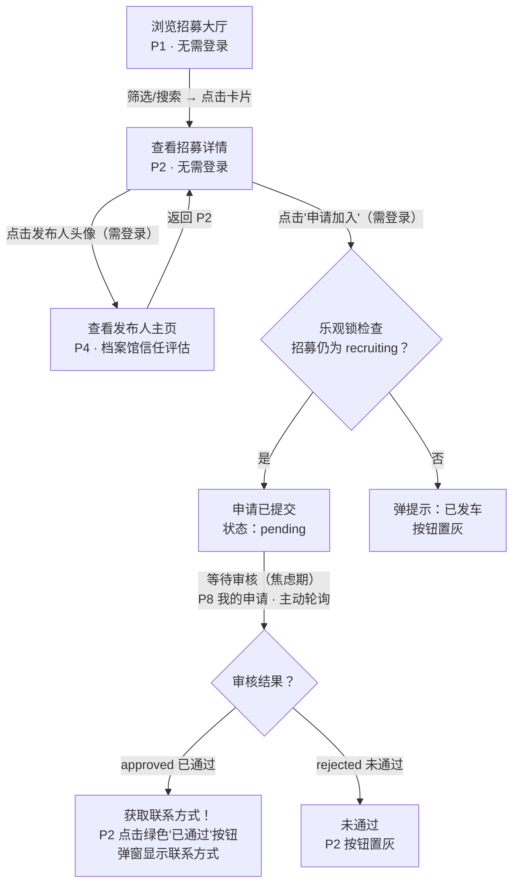

# 跑团组局小程序 · 流程图合集（Mermaid）

> **基于 PRD V1.2（prd032402）+ 页面逻辑梳理 v3**
> **整理日期：2026 年 3 月 29 日**
> **使用方式：在 GitHub / VS Code / Typora 中打开即可自动渲染为流程图**

---

## 一、招募状态流转图

> 发车时联动规则：所有 pending（审核中）的申请自动归并为 rejected（未通过）

---

## 二、申请状态流转图

> cancelled（已取消）为 MVP 预留字段，暂不实现

---

## 三、页面跳转图 — Tab1 分支（招募大厅）

> 外部入口：微信分享卡片 → 直接打开 P2 招募详情页（带 id 参数）

---

## 四、页面跳转图 — Tab2 分支（我的）

> P3 发布/保存成功后使用 redirectTo → P8，替换栈顶，避免返回空表单

---

## 五、发布人用户旅程图

### 发布人情绪曲线

| 阶段 | 情绪 | 说明 |
|---|---|---|
| 打开 → 填表单 | 顺畅 | 极简流程，10 秒完成 |
| 保存 or 发布 | 犹豫 | 信息填完了吗？要不要先存草稿？ |
| 等待申请 | 焦虑 | 有没有人来？需不需要去分享？ |
| 审批申请人 | 投入 | 这个人靠谱吗？看看档案馆 |
| 发车 | 满足 | 人齐了，出发！ |

---

## 六、申请人用户旅程图

### 申请人情绪曲线

| 阶段 | 情绪 | 说明 |
|---|---|---|
| 浏览大厅 | 随意 | 随便看看有没有合适的车 |
| 查看详情 + 档案馆 | 好奇 | 这个 KP 靠谱吗？看看 ta 的跑团记录 |
| 点击申请 | 期待 | 希望能上车 |
| 等待审核 | 焦虑 | 会通过吗？什么时候出结果？ |
| 收到结果 | 释然或失望 | 通过了就拿联系方式，没通过就继续找 |

---

*所有 Mermaid 图表可在 GitHub、VS Code（需安装 Mermaid 插件）、Typora 中自动渲染。*
