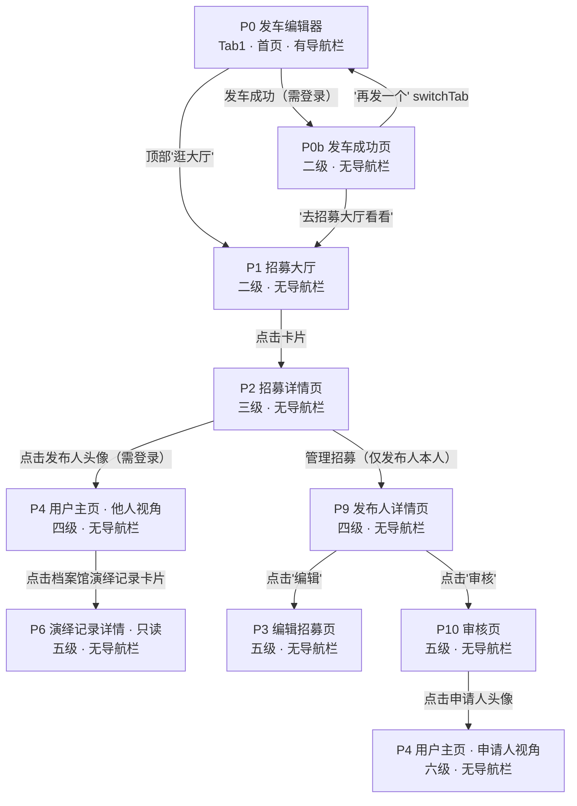
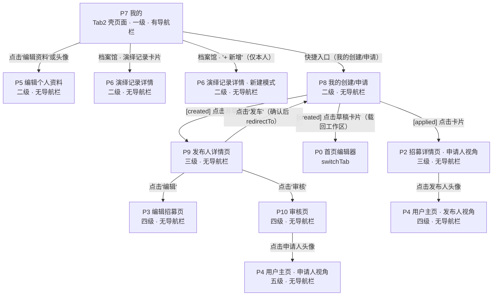
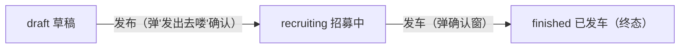
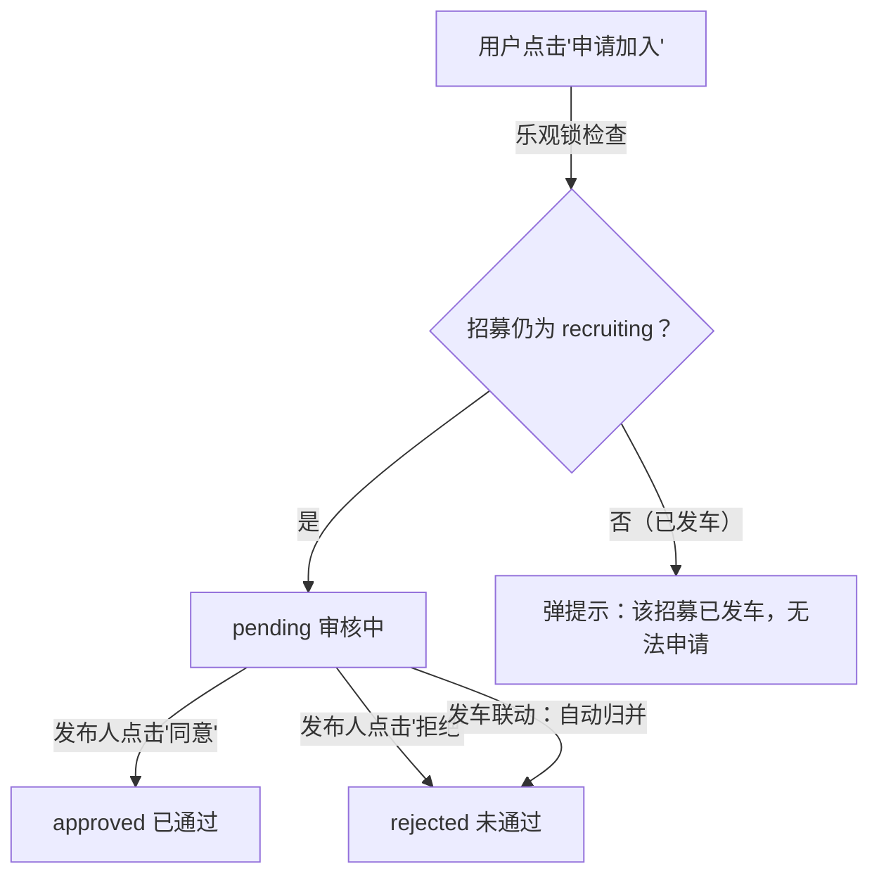
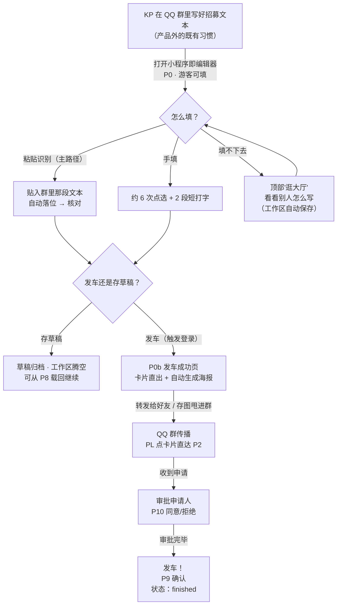
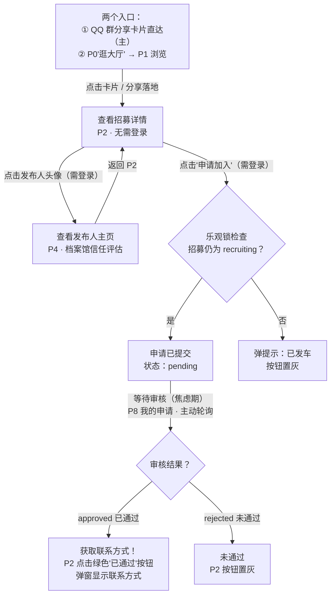

# 跑团组局小程序 · 产品需求文档（PRD）

> **版本：V1.5 插件化改版**
> **最后更新：2026 年 7 月 18 日**
> **基于版本：V1.4 MVP 收口版（prd_v1_4.md）**
>
> **本版变更概述：** 产品重心从「平台」收回到「插件」——首页由招募大厅改为发车编辑器，发布后直出可分享卡片；新增粘贴识别（规则解析器）与工作区/草稿箱模型；时间改为弹性双维度（留空即待商量）；发布必填降为三项。详见第 20 章。
> **配套文档：**《粘贴识别规则手册.md》（解析规则与样本对照，与 `scripts/test-parse.mjs` 回归测试互为镜像）。

---

## 目录

1. [基本信息](#1-基本信息)
2. [用户角色](#2-用户角色)
3. [登录与授权](#3-登录与授权)
4. [信息架构与全局导航](#4-信息架构与全局导航)
5. [MVP 页面全景清单](#5-mvp-页面全景清单)
6. [页面跳转关系](#6-页面跳转关系)
7. [权限矩阵](#7-权限矩阵)
8. [招募状态与申请状态联动](#8-招募状态与申请状态联动)
9. [页面结构详细定义](#9-页面结构详细定义)
10. [空状态定义](#10-空状态定义)
11. [用户旅程](#11-用户旅程)
12. [共用组件](#12-共用组件)
13. [数据结构](#13-数据结构)
14. [技术规范](#14-技术规范)
15. [UI 设计规范](#15-ui-设计规范)
16. [历史待办清账](#16-历史待办清账)
17. [未来规划](#17-未来规划)
18. [V1.4 变更说明](#18-v14-变更说明)
19. [已完成功能归档](#19-已完成功能归档)
20. [V1.5 变更说明](#20-v15-变更说明)

---

## 1. 基本信息

| 属性 | 内容 |
|---|---|
| 产品定位 | QQ 群跑团生态的高效率组局**插件**（非跑团工具本体，非平台） |
| 一句话产品 | 10 秒把跑团招募信息变成一张能甩进 QQ 群的好看卡片 |
| 适用端 | 微信小程序 / QQ 小程序（双端互通） |
| 北极星指标 | 发布人完成一次招募发布的时间 < 10 秒 |
| 核心理念 | 极简，不改变玩家原有 QQ 群跑团习惯——KP 本来就要在群里发招募文本，产品只在末端接住并美化 |
| 分发模型 | 先群后厅：冷启动期靠 QQ 群传播（卡片 → 详情页直达），大厅是从属的参考区 |
| 技术栈 | uni-app + Vue3 + Vite + Pinia（JavaScript） |
| 后端方案 | 微信云开发（wx.cloud），云数据库 4 个集合 + 16 个云函数 |

**V1.5 定位重申（插件 vs 平台）：** 插件的动作是「我帮你把东西做好，你拿去你自己的地盘用」；平台的动作是「大家都上我这儿来」。据此本版将大厅（平台器官）降级为编辑器内入口，将发布产出从「列表里的一条记录」改为「交到手上的成品卡片」。依据来自深度玩家合伙人的判断：跑团玩家介意过度商业化，大量同类项目死于「太想商业化 → 弄复杂 → 爆死」；处方为工具化、保持简单、可以好看但不要复杂。

---

## 2. 用户角色

### 2.1 发布人（GM 或 PL 均可）

核心诉求：快速发车，招募到靠谱的玩家。

**最高频动作：**

- 发布招募（极简表单，目标 10 秒内完成）
- 审批申请人：查看申请人列表 → 点击进入申请人主页 → 同意或拒绝
- 同意申请后：系统自动将联系方式展示给申请人（申请人主动查看）
- 手动点击「发车」按钮，将招募状态改为已发车

### 2.2 申请人（PL 或 GM）

核心诉求：快速找到符合时间和规则体系的车，顺利上车。

**最高频动作：**

- 从 QQ 群里点分享卡片直达详情页（主入口，先群后厅）；或从 P0「逛大厅」浏览
- 查看发布人主页及档案馆，判断是否值得申请
- 报名上车（申请加入）
- 在「我的申请」中主动轮询查看审批结果
- 审批通过后：点击详情页底部按钮弹出发布人联系方式

---

## 3. 登录与授权

小程序**不设独立登录页面**，授权通过 `wx.login` 弹窗触发，封装在 `src/utils/auth.js` 的 `checkLogin()` 方法中。授权完成后继续执行被拦截的操作。

**核心原则：游客可以看、可以填，动到云端数据才要登录。** 首页编辑器（P0）游客可随意填写（内容存在本地工作区），点「发车」或「存草稿」时才触发登录；大厅（P1）与详情页（P2）浏览、分享无需登录。

| 页面/操作 | 是否需要登录 |
|---|---|
| 浏览首页编辑器（P0）并填写表单 | 否（内容存本地工作区） |
| P0 点「发车」/「存草稿」 | 是 |
| P0 点「粘贴识别」/「逛大厅」 | 否 |
| 浏览招募大厅（P1） | 否 |
| 查看招募详情页（P2）内容 | 否 |
| P2 点击分享图标 | 否 |
| P2 点击「申请加入」 | 是 |
| P2 点击发布人头像 → 用户主页 | 是 |
| 进入 Tab2「我的」（P7） | 是 |
| 进入用户主页（P4） | 是 |
| 进入编辑招募页（P3，带 ?id=） | 是（onLoad 拦截，拒绝授权则退回） |
| 进入编辑个人资料（P5） | 是 |
| 进入演绎记录详情（P6） | 是 |
| 进入我的创建/申请（P8） | 是 |
| 进入发布人详情页（P9） | 是 |
| 进入审核页（P10） | 是 |

> 后端接入后，授权成功后调用 `user-login` 云函数登录，openid 由后端管理。前端 store 保留用户资料。

### 退出登录

- 入口：P7「我的」页面设置入口
- 行为：清空 store 中的用户数据 → `switchTab` 回到 P0 首页编辑器 → 恢复游客态
- 退出后用户可继续以游客身份使用 P0 编辑器、浏览 P1 和 P2

---

## 4. 信息架构与全局导航

### 4.1 底部导航栏（自定义 TabBar）

底部 TabBar 共 **2 个 tab 页**，使用**自定义 TabBar 组件**（`src/custom-tab-bar/`）。V1.5 起**无中间凸起按钮**——发布不再是一个入口，而是首页本身：

| 视觉位置 | 页面 | 跳转方式 | 核心功能 |
|---|---|---|---|
| 左 | 发车编辑器（P0，首页/启动页） | `switchTab` | 招募表单工作区 + 顶部工具栏（粘贴识别/逛大厅），游客可填 |
| 右 | 我的（P7） | `switchTab` | 个人主页（本人视角）、档案馆、我的创建/申请 |

**底部导航栏显示规则：** 只有 TabBar 页面（P0、P7）显示底部导航栏，所有子页面自动隐藏，这是微信的默认行为。

**TabBar 选中态：** 自定义 TabBar 下系统不再自动管理选中态，每个 tab 页面的 `onShow` 中须经 `getCurrentPages()` 取页面实例调 `page.getTabBar().setData({ selected: N })` 更新（`getTabBar` 是页面实例方法，不是全局函数）。

### 4.2 首页顶部工具栏（吸顶）

P0 编辑器顶部有一条吸顶按钮工具栏（`position: sticky; top: 0; z-index: 10`，滚动不消失）：

| 按钮 | 行为 |
|---|---|
| 粘贴识别 | 读剪贴板 → 规则解析 → 落位到表单字段（详见 9.0 与《粘贴识别规则手册.md》） |
| 逛大厅 | `navigateTo` 到招募大厅 P1（大厅不再是 tab 页） |

设计意图：大厅从属于编辑——用户填不下去时随时能去看别人怎么写，工作区自动保存保证跳出去再回来内容不丢。

### 4.3 页面栈与返回机制

微信小程序维护一个"页面栈"，可以理解成一摞扑克牌：

| 跳转方式 | 行为 | 使用场景 |
|---|---|---|
| `navigateTo` | 在栈顶加一张新牌（打开新页面） | 跳转普通子页面 |
| `navigateBack` | 拿走栈顶那张牌（返回上一页） | 点击返回按钮 |
| `switchTab` | 切换到 TabBar 页面，清空非 TabBar 的页面栈 | 切换底部 Tab |
| `redirectTo` | 替换栈顶那张牌（不增加栈深度） | 表单提交后跳转，避免返回空表单 |

> 本文档中所有"返回上一页"均指 `navigateBack()`，返回到哪个页面取决于用户从哪条路径走过来，不硬编码目标页面。

---

## 5. MVP 页面全景清单

共 **12 个页面**（含 2 个 TabBar 页面 + 10 个普通子页面）。

| 编号 | 页面路径 | 页面名称 | 页面类型 | 层级 | 一句话说明 |
|---|---|---|---|---|---|
| P0 | pages/publish/index | 发车编辑器 | TabBar（Tab1，首页/启动页） | 一级 | 招募表单工作区，顶部吸顶工具栏（粘贴识别/逛大厅） |
| P0b | pages/publish/result | 发车成功页 | 子页面 | 二级 | 发布后直出招募卡片：转发好友/生成图片/再发一个/逛大厅 |
| P1 | pages/home/index | 招募大厅 | 子页面 | 二级 | 从 P0「逛大厅」进入的参考区，纯卡片列表（无搜索无筛选） |
| P2 | pages/home/detail | 招募详情页 | 子页面 | 二级/三级 | 查看某条招募的完整信息，申请加入；群分享卡片直达此页 |
| P3 | pages/publish/form | 编辑招募页 | 子页面 | 三级 | 仅编辑场景（带 ?id=），复用 ModuleForm 组件；新建走 P0 |
| P4 | pages/profile/index | 用户主页 | 子页面 | 二级/三级 | 查看某用户的个人信息和档案馆（含吸顶 tab） |
| P5 | pages/profile/edit | 编辑个人资料 | 子页面 | 二级 | 修改自己的昵称、性别、签名、联系方式等 |
| P6 | pages/profile/log_detail | 演绎记录详情 | 子页面 | 二级/三级 | 查看或编辑一条演绎记录 |
| P7 | pages/mine/index | 我的 | TabBar（Tab2） | 一级 | Tab2 壳页面，渲染本人视角的用户主页 |
| P8 | pages/mine/created | 我的创建/申请 | 子页面 | 二级 | 两个 tab 视图共用一页；草稿在「我的创建」中可载回工作区、可删除 |
| P9 | pages/mine/detail | 发布人详情页 | 子页面 | 三级 | 发布人管理自己的招募（编辑/审核/发车） |
| P10 | pages/mine/review | 审核页 | 子页面 | 四级 | 发布人审批申请人（同意/拒绝） |

### 层级说明

- **一级页面**：TabBar 页面，底部导航栏直接可达（P0、P7）
- **二级页面**：从一级页面点击进入的子页面
- **三级页面**：从二级页面点击进入的子页面
- **四级页面**：从三级页面点击进入的子页面
- 同一个页面根据进入路径不同，可能处于不同层级（如 P2、P4、P6）

### 补充说明

- **P0 与 P3 共用表单组件** `components/ModuleForm.vue`：P0 是新建模式（工作区，持续本地自动保存），P3 是编辑模式（带 ?id=，改动未保存时启用系统级离开提示）。导航去向由页面层通过组件事件（published / draft-saved / updated）决定。
- **P7 是 P4 本人视角的壳页面**：因微信 TabBar 页面不支持 URL 传参，P7 自动注入当前用户 uid，复用 P4 的组件逻辑（`components/UserProfileContent.vue`），不单独维护 UI。
- **switchTab 不能带参数**：跨 tab 传递数据经 store 字段（编辑用 `editingModuleId`，草稿载回用 `pendingDraftId`）。
- **已废弃**：TabBar 中间凸起「+」按钮（发布即首页，不再需要入口）；P1 的搜索栏与 8 个筛选 tag（平台化的电商骨架，与插件定位冲突）；`pages/auth/login`；`components/FloatBtn.vue`。

---

## 6. 页面跳转关系

### 6.0 从发车编辑器（P0，首页）出发

| 触发操作 | 目标页面 | 跳转方式 | 备注 |
|---|---|---|---|
| 点击顶部「逛大厅」 | P1 招募大厅 | navigateTo | 无需登录；工作区自动保存，回来内容不丢 |
| 点击顶部「粘贴识别」 | 留在当前页 | — | 读剪贴板 → 解析落位 → Toast「已识别 N 项」 |
| 点击「发车」（校验通过） | P0b 发车成功页 | navigateTo(?id=新id) | 触发登录；成功后工作区自动清空 |
| 点击「存草稿」 | 留在当前页 | — | 触发登录；归档为云端草稿，工作区腾空，Toast「已存进草稿箱」 |
| 点击「清空重来」 | 留在当前页 | — | 二次确认弹窗（唯一弹窗），确认后清空工作区 |
| 点击底部 Tab2 | P7 我的 | switchTab | 需登录 |

### 6.0b 从发车成功页（P0b）出发

| 触发操作 | 目标页面 | 跳转方式 | 备注 |
|---|---|---|---|
| 点击「转发给好友」 | 微信转发面板 | button open-type=share | 分享卡片落地到 P2（带 id） |
| 点击「生成图片保存」 | 留在当前页 | — | Canvas 生成海报 → 预览 → 保存相册（进入页面时也会自动生成一次） |
| 点击「再发一个」 | P0 首页编辑器 | switchTab | 工作区已清空 |
| 点击「去招募大厅看看」 | P1 招募大厅 | navigateTo | — |

### 6.1 从招募大厅（P1）出发

| 触发操作 | 目标页面 | 跳转方式 | 需要登录 |
|---|---|---|---|
| 点击招募卡片 | P2 招募详情页 | navigateTo(?id=xxx) | 否 |
| 点击返回 | 上一页（通常是 P0） | navigateBack | — |

### 6.2 从招募详情页（P2）出发

| 触发操作 | 目标页面 | 跳转方式 | 需要登录 |
|---|---|---|---|
| 点击发布人头像/昵称 | P4 用户主页（他人视角） | navigateTo(?uid=xxx) | 是 |
| 点击「申请加入」（游客） | 留在当前页，弹授权窗 | — | 是 |
| 点击「已通过」按钮 | 留在当前页，弹联系方式窗 | — | — |
| 点击分享图标 | 弹出自定义分享菜单（转发好友 / 生成海报） | — | 否 |
| 点击「管理招募」链接（仅发布人本人可见） | P9 发布人详情页 | navigateTo(?id=xxx) | — |
| 点击返回 | 上一页（由页面栈决定） | navigateBack | — |

**微信分享落地页：** 用户将招募分享给微信好友后，好友在聊天中看到分享卡片，点击该卡片会打开小程序并直接进入 P2 招募详情页（携带该招募的 id 参数）。

### 6.3 从编辑招募页（P3，仅编辑模式）出发

| 触发操作 | 目标页面 | 跳转方式 | 备注 |
|---|---|---|---|
| 点击「保存」（编辑非草稿） | 上一页（P9） | navigateBack | 保持原状态（招募中保存后仍是招募中，不会被降为草稿或重新发车） |
| 点击「发车」（编辑草稿） | 上一页 | navigateBack | 草稿转为招募中 |
| 点击「存草稿」（仅编辑草稿时显示） | 上一页 | navigateBack | 编辑已发布招募时该按钮隐藏（防误下架） |
| 返回键（有未保存改动） | 系统级弹窗「修改尚未保存，确认离开？」 | wx.enableAlertBeforeUnload | 仅编辑模式启用；无改动直接返回 |
| 不带 ?id= 误入 | P0 首页编辑器 | switchTab | 兜底：本页只承担编辑场景 |

### 6.4 从用户主页（P4）/ 我的壳页面（P7）出发

P7 与 P4 本人视角完全相同，以下统一说明。

| 触发操作 | 可见性 | 目标页面 | 跳转方式 |
|---|---|---|---|
| 点击「编辑资料」按钮 | 仅本人 | P5 编辑个人资料 | navigateTo |
| 点击头像 | 仅本人 | P5 编辑个人资料 | navigateTo |
| 点击「我的创建」入口 | 仅本人 | P8(?tab=created) | navigateTo |
| 点击「我的申请」入口 | 仅本人 | P8(?tab=applied) | navigateTo |
| 点击「我的足迹」入口 | 仅本人 | — | Toast「即将开放」 |
| 点击「我的心愿」入口 | 仅本人 | — | Toast「即将开放」 |
| 点击档案馆·演绎记录缩略卡片 | 本人和他人 | P6 演绎记录详情 | navigateTo(?id=xxx) |
| 点击档案馆·演绎记录「+ 新增」 | 仅本人 | P6 演绎记录详情·新建模式 | navigateTo（无 id） |
| 点击档案馆·其他 tab 内容 | 本人和他人 | — | Toast「即将开放」 |
| 点击「设置」入口 | 仅本人 | 退出登录确认弹窗 | 确认后清空 store → switchTab 回 P0 首页编辑器 |

### 6.5 从编辑个人资料（P5）出发

| 触发操作 | 目标页面 | 跳转方式 | 备注 |
|---|---|---|---|
| 保存成功 | P7（我的） | navigateBack | 只有本人能进入 P5，路径一定是 P7 → P5 |
| 点击返回 | P7（我的） | navigateBack | 同上 |

### 6.6 从演绎记录详情（P6）出发

| 触发操作 | 目标页面 | 跳转方式 | 备注 |
|---|---|---|---|
| 点击「保存」（编辑态，仅本人） | 留在当前页 | — | 切换回浏览态 |
| 点击返回 | 上一页（P4 或 P7） | navigateBack | 回到用户主页 |

### 6.7 从我的创建/申请（P8）出发

| 触发操作 | 当前 tab | 目标页面 | 跳转方式 |
|---|---|---|---|
| 点击非草稿卡片 | created（我的创建） | P9 发布人详情页 | navigateTo(?id=xxx) |
| 点击草稿卡片 | created | P0 首页编辑器 | store.pendingDraftId + switchTab（草稿载回工作区继续编辑） |
| 点击草稿卡片上的「删除」 | created | 留在当前页 | 二次确认 → module-delete 云函数 → 刷新列表 |
| 点击卡片 | applied（我的申请） | P2 招募详情页 | navigateTo(?id=xxx) |
| 点击「去发布」（空状态等入口） | created | P0 首页编辑器 | switchTab |
| 切换顶部 tab | 任意 | 留在当前页 | 页面内 tab 切换 |
| 点击返回 | 任意 | 上一页 | navigateBack |

**载回草稿的「永不丢失」规则：** 若工作区已有内容，先自动把当前内容归档为草稿（未起名的存为「未命名草稿」），再载入目标草稿——不弹窗、不询问、不丢失。

### 6.8 从发布人详情页（P9）出发

| 触发操作 | 卡片状态 | 目标页面 | 跳转方式 |
|---|---|---|---|
| 点击「编辑」 | draft（草稿）或 recruiting（招募中） | P3 编辑招募页 | navigateTo(?id=xxx) |
| 点击「发布」 | draft（草稿） | 留在当前页 | 弹「发出去喽」确认，状态变为 recruiting（招募中） |
| 点击「审核」 | recruiting（招募中） | P10 审核页 | navigateTo(?id=xxx) |
| 点击「发车」 | recruiting（招募中） | P8 我的创建 | 弹确认窗，确认后 redirectTo(?tab=created) |
| 点击分享按钮 | 任意 | 弹出分享菜单 | — |
| 点击返回 | 任意 | 上一页（P8） | navigateBack |

### 6.9 从审核页（P10）出发

| 触发操作 | 目标页面 | 跳转方式 | 备注 |
|---|---|---|---|
| 点击申请人头像/昵称 | P4 用户主页（他人视角） | navigateTo(?uid=xxx) | 查看申请人档案 |
| 点击「同意」/「拒绝」 | 留在当前页 | — | 按钮替换为状态标签 |
| 点击返回 | P9 发布人详情页 | navigateBack | P9 通过 onShow 自动刷新 |

### 6.10 页面跳转简图

#### Tab1 分支

> 外部入口：微信分享卡片 → 直接打开 P2 招募详情页（带 id 参数）。**这是先群后厅分发模型的主通道**——PL 从群里点卡片直达详情页，不经过首页。

#### Tab2 分支

---

## 7. 权限矩阵

### 7.1 全局操作

| 操作 | 游客 | 已登录用户 |
|---|---|---|
| 浏览首页编辑器（P0）并填写 | ✅（内容存本地工作区） | ✅ |
| P0 粘贴识别 / 逛大厅 | ✅ | ✅ |
| P0 点「发车」/「存草稿」 | 🔒 弹授权 | ✅ |
| 浏览招募大厅（P1） | ✅ | ✅ |
| 查看招募详情（P2）内容 | ✅ | ✅ |
| P2 点击分享图标 | ✅ | ✅ |
| P2 点击「申请加入」 | 🔒 弹授权 | ✅ |
| P2 点击发布人头像 | 🔒 弹授权 | ✅ |
| 进入 Tab2「我的」 | 🔒 弹授权（取消则退回 P0） | ✅ |
| 进入其他所有页面（P3-P10） | 🔒 弹授权 | ✅ |

### 7.2 招募详情页（P2）操作

| 操作 | 游客 | 已登录·非发布人·未申请 | 已登录·非发布人·已申请 | 已登录·发布人本人 |
|---|---|---|---|---|
| 浏览招募内容 | ✅ | ✅ | ✅ | ✅ |
| 点击「申请加入」 | 🔒 弹授权 | ✅ 提交申请 | ❌ 按钮显示对应状态 | ❌ 灰色不可点，弹提示 |
| 查看联系方式弹窗 | ❌ | ❌ | ✅（仅 approved 已通过） | ❌ |
| 点击发布人头像 | 🔒 弹授权 | ✅ | ✅ | ✅（跳自己主页） |
| 看到「管理招募」链接 | ❌ | ❌ | ❌ | ✅ |
| 点击分享 | ✅ | ✅ | ✅ | ✅ |

### 7.3 发布与管理操作

| 操作 | 游客 | 已登录·非发布人 | 已登录·发布人本人 |
|---|---|---|---|
| 创建新招募（P3 新建模式） | 🔒 | ✅ | ✅ |
| 编辑已有招募（P3 编辑模式） | ❌ | ❌ | ✅（编辑不影响已有申请，已知限制） |
| 查看发布人详情页（P9） | ❌ | ❌ | ✅ |
| 进入审核页（P10） | ❌ | ❌ | ✅（仅 recruiting 招募中状态） |
| 审批申请人 | ❌ | ❌ | ✅（通过人数不受招募人数限制） |
| 发车操作 | ❌ | ❌ | ✅（仅 recruiting 招募中状态） |
| 保存草稿 | 🔒 | ✅ | ✅ |

### 7.4 用户主页与档案馆操作

| 操作 | 游客 | 已登录·查看他人 | 已登录·查看自己 |
|---|---|---|---|
| 查看个人信息 | ❌ | ✅ | ✅ |
| 查看档案馆·演绎记录缩略卡片 | ❌ | ✅ | ✅ |
| 点击进入演绎记录详情（P6） | ❌ | ✅（只读） | ✅（可编辑） |
| 新增演绎记录 | ❌ | ❌ | ✅ |
| 编辑/保存演绎记录 | ❌ | ❌ | ✅ |
| 编辑个人资料（P5） | ❌ | ❌ | ✅ |
| 查看快捷入口 | ❌ | ❌ | ✅ |
| 查看关注/粉丝/获赞 | ❌ | ✅（占位，值为 0） | ✅（占位，值为 0） |

---

## 8. 招募状态与申请状态联动

### 8.1 招募状态流转

| 状态 | 触发条件 | 可执行操作 |
|---|---|---|
| draft（草稿） | 发布人点「保存草稿」 | 编辑、发布（→ recruiting） |
| recruiting（招募中） | 发布人点「发布」确认 | 编辑、审核、发车（→ finished） |
| finished（已发车） | 发布人手动点「发车」并确认 | 仅只读，不可逆 |

> **发车联动规则：** 发布人点击「发车」确认后，系统自动将所有仍处于 `pending`（审核中）状态的申请统一标记为 `rejected`（未通过）。发布人无需手动逐一拒绝。

> 架构备注：状态字段为 `status`（string），预留未来在「我的创建」列表顶部增加 Tab 筛选（全部 / 招募中 / 草稿 / 已发车）。

### 8.2 申请状态流转

> cancelled（已取消）为 MVP 预留字段，暂不实现。

### 8.3 「我的申请」卡片显示（申请状态 × 招募状态）

| 申请状态 | 招募 recruiting（招募中）时 | 招募 finished（已发车）后 |
|---|---|---|
| pending（审核中） | 审核中 | （已归并为 rejected）→ 未通过 · 已发车 |
| approved（已通过） | ✓ 已通过 | ✓ 已通过 · 已发车 |
| rejected（未通过） | 未通过 | 未通过 · 已发车 |

### 8.4 招募详情页（P2）底部按钮完整状态表

| 招募状态 | 访问者身份 | 申请状态 | 按钮文字 | 可点击 | 点击行为 |
|---|---|---|---|---|---|
| recruiting（招募中） | 游客 | — | 申请加入 | ✅ | 触发授权弹窗 |
| recruiting（招募中） | 已登录他人 | 无申请 | 申请加入 | ✅ | 乐观锁检查 → 提交申请 |
| recruiting（招募中） | 已登录他人 | pending（审核中） | 等候审核中 | ❌ | — |
| recruiting（招募中） | 已登录他人 | approved（已通过） | 已通过 | ✅ | 弹联系方式弹窗 |
| recruiting（招募中） | 已登录他人 | rejected（未通过） | 未通过 | ❌ | — |
| recruiting（招募中） | 发布人本人 | — | 申请加入 | ❌ | 弹提示「你是本次招募的发布人，无法申请」 |
| finished（已发车） | 已登录他人 | approved（已通过） | ✓ 已通过 · 已发车 | ✅ | 弹联系方式弹窗（发车后仍可查看） |
| finished（已发车） | 其他所有人 | — | 已发车 | ❌ | — |

> 说明：用户申请过一次后（无论审核结果如何），再次进入同一条招募的 P2 详情页时，底部按钮直接显示对应的申请状态，不可再次申请。

---

## 9. 页面结构详细定义

### 9.0 发车编辑器（首页）`pages/publish/index.vue` + `components/ModuleForm.vue`

**产品的重心页面。启动即编辑器，游客可填，工作区持续本地自动保存。**

#### 页面结构（从上到下）

- **吸顶工具栏**（`position: sticky; top: 0; z-index: 10`，滚动不消失）：两个并排按钮「粘贴识别」「逛大厅」
- **表单主体**（`ModuleForm.vue` 新建模式，主路径 5 项 + 折叠区）
- 「清空重来」文字入口（有内容时显示，二次确认）
- 底部吸底双按钮：存草稿 / 发车

#### 表单字段（V1.5：必填三项，点选为主）

**10 秒可达的前提是控件类型：手填动作以点选为主，全程仅约 6 次点选 + 2 段短打字（模组名、联系号码）。**

主路径（按序）：

| 字段 | 控件 | 必填 | 说明 |
|---|---|---|---|
| 模组名称 | 文字输入 | **是** | 不超过 20 字 |
| 跑团日 | 7 天多选 tag | 否 | 留空 = 日期可协商（弹性时间模型） |
| 开始时间 | time picker | 否 | 留空 = 时段可协商 |
| 招募 PL | 1–6 数字 tag 点选 | **是** | 存为 `plCount` |
| 联系方式 | 3 tag 单选 + 文字输入 | **是** | 微信号 / QQ 号 / QQ 群号；审核通过后自动展示给申请人；存为 `contact: { type, value }` |

「更多设置」折叠区（不展开也能发车，均有默认值或可空）：

| 字段 | 控件 | 默认 |
|---|---|---|
| 模组封面 | 图片上传 | 空（卡片美观由模板负责，不依赖封面） |
| 跑团规则 | 单选：COC7th / COC6th / DND5e / 其他 | COC7th |
| 跑团方式 | 单选：语音 / 文字 | 语音 |
| 招募 KP | Toggle | 关 |
| 结束时间 | time picker | 空 |
| 预计时长 | 文字输入 | 空 |
| 模组简介 | 多行文本（300 字） | 空 |

`playerCount`（总人数）不是输入项，由 `plCount + (recruitKP ? 1 : 0)` 自动计算。

#### 弹性时间模型

日期（gameDays）与时段（startTime）是**两个独立维度**，各自有「确定 / 可协商」两种状态，**留空即可协商，不加任何开关字段**。展示层（`formatGameTime`）四态渲染：

| gameDays | startTime | 卡片显示 |
|---|---|---|
| 有 | 有 | `周六、周日 20:00-23:00`（无「每」前缀——对单次团中性） |
| 有 | 空 | `周六、周日` |
| 空 | 有 | `19:00-22:00` |
| 空 | 空 | `时间待商量`（仅全空时兜底出现） |

7 天全选渲染为「每天」；排序时周日排最后。

#### 粘贴识别

顶部「粘贴识别」按钮：读剪贴板 → 规则解析（`src/utils/parseRecruitText.js`，纯前端，零延迟）→ **只覆盖识别出的字段**，识别不出的保留现状 → Toast「已识别 N 项，请核对」。识别结果落进折叠区的（时长/简介）会自动展开折叠区。

**原则：空着可以，乱填不行。** 解析失败零副作用，落回手填。规则清单、样本库、边界案例见《粘贴识别规则手册.md》；回归测试 `npm run test:parse`。规则覆盖不了的样本积攒进手册的「LLM 兜底候选池」，作为将来上模型的依据。

#### 工作区（本地持久化）

- 表单任何变化 400ms 防抖写入本地 storage（`publish_workspace_v1`），杀进程重进自动恢复——**永不丢失**
- 工作区只有一个，不产生 draft 云记录（云端草稿只在点「存草稿」时产生）
- 从草稿箱载入草稿时若工作区有内容：自动先归档为草稿再载入，不弹窗
- 发车成功 / 存草稿成功后工作区自动清空
- 不启用离开拦截弹窗（切 tab、逛大厅随便走，内容不丢）

#### 底部按钮

| 按钮 | 样式 | 行为 |
|---|---|---|
| 存草稿 | 浅色次按钮 | 触发登录 → 归档为云端草稿（仅要求已填名称）→ 工作区腾空 → Toast「已存进草稿箱」 |
| 发车 | 深色主按钮 | 触发登录 → 校验必填三项 → module-publish（recruiting）→ 跳 P0b 发车成功页 |

---

### 9.0b 发车成功页 `pages/publish/result.vue`

**发布产出是交到手上的成品卡片，不是列表里的一条记录——「工具不是平台」的关键页面。**

- 顶部文案：「发出去喽 / 把它甩进群里，等人来」
- 招募卡片预览（复用大厅卡片信息结构）
- 进入页面自动调用海报生成一次（生成失败不阻塞页面，其余按钮可用）
- 操作（按序）：转发给好友（open-type=share，落地 P2）/ 生成图片保存（Canvas 海报 → 预览 → 存相册）/ 再发一个（switchTab 回 P0）/ 去招募大厅看看

> 卡片/海报排版将重新设计（与设计合作方协作），当前复古邀请函样式为占位。

---

### 9.1 招募大厅 `pages/home/index.vue`

**V1.5 定位：从首页「逛大厅」进入的参考区（「看看别人怎么写」），不是搜索型信息流。**

**重要规则：只展示 status = recruiting 的卡片，已发车卡片不在此页出现。**

**数据刷新规则：页面每次 `onShow` 时重新读取一次数据。**

**排序规则：MVP 不做排序，按数据原始顺序展示。**

> **V1.5 移除**：搜索栏与 8 个筛选 tag（搜索+筛选+卡片流是平台/电商的视觉语言，与插件定位冲突；参考场景不需要检索）。若未来大厅升级为主动找团入口（「后厅」阶段），再按需恢复。

#### 招募卡片内容

| 元素 | 说明 |
|---|---|
| 封面图 | 100×100rpx，圆角 10rpx，无图则显示占位色块 #d9d9d9 |
| 模组名称 | 粗体，36rpx，主标题 |
| Tag 行 | 跑团方式 / 规则体系 / 招募人数 |
| 信息行一 | 预计时长 │ 招募对象 |
| 信息行二 | 跑团时间（`formatGameTime()` 弹性四态渲染）│ 招募人 ID（右对齐，#b2b2b2） |
| 右下角人数 | 招募中状态显示「X 人申请」；已发车状态不显示人数 |

---

### 9.2 招募详情页 `pages/home/detail.vue`

**所有人进入此页面均显示申请人视角，包括发布人本人。**

**数据刷新规则：页面每次 `onShow` 时重新读取一次数据。**

#### 页面结构（从上到下）

- 顶部导航栏：模组名称（居中）+ 返回按钮
- 页面内容区右上角：分享图标（圆形占位色块 #666666，32×32rpx，位于页面内容区内，不得进入导航栏区域）
- 封面图（100×100rpx）+ 发布人头像/昵称 → 点击触发登录后跳转用户主页
- Tag 行：跑团方式 / 规则体系 / 人数
- 信息行：预计时长 / 招募对象 / 跑团时间（`formatGameTime()` 格式化）
- 分割线 + 「模组简介」标题
- 简介正文（长文，支持长按复制）
- **发布人本人视角专属**：内容区某处显示「管理招募」文字链接，点击跳转 `pages/mine/detail?id=xxx`
- 底部吸底按钮（状态见第 8.4 章完整状态表）

#### 申请时的状态检查（乐观锁）

用户点击「申请加入」时，系统先确认该卡片当前状态：
- 仍为 `recruiting`：正常提交申请
- 已变为 `finished`：弹提示「该招募已发车，无法申请」，底部按钮同步变为灰色「已发车」

#### 分享功能

点击分享图标弹出自定义分享菜单（`ShareMenu.vue`），提供两种方式：

| 方式 | 实现 |
|---|---|
| 转发给好友 | 微信原生 `button open-type="share"` + `onShareAppMessage`，标题为模组名称 |
| 生成海报 | 调用 `PosterGenerator.vue`，使用 Canvas 2D 绘制复古邀请函风格海报，支持预览和保存到相册 |

分享卡片点击后直接打开 P2 招募详情页（带 id 参数）。

#### 联系方式弹窗

- 标题：你已通过审核
- 内容：发布人预设的联系方式（微信号 / QQ 号 / QQ 群号 + 具体号码）
- 按钮：我知道了（关闭弹窗）
- 弹窗可反复打开，无次数限制

> 联系方式**只在此弹窗里展示**，不在任何列表卡片上直接显示，保护发布人隐私。

---

### 9.3 编辑招募页 `pages/publish/form.vue`（仅编辑模式）

**此页面为普通子页面，不在 TabBar 中，有原生返回箭头。V1.5 起仅承担编辑场景；新建统一走 P0 首页编辑器。**

入口：
- 发布人详情页（P9）「编辑」按钮 → 带 `?id=`，所有字段回填（复用 `ModuleForm.vue` 编辑模式）
- 不带 id 误入时兜底 `switchTab` 回 P0

表单字段与 P0 完全一致（同一个组件），差异仅在行为：

| 行为 | 新建模式（P0 工作区） | 编辑模式（P3） |
|---|---|---|
| 内容来源 | 本地工作区（自动恢复） | 云端按 id 回填 |
| 自动保存 | 本地持续防抖保存 | 无（显式保存） |
| 离开拦截 | 无 | 有未保存改动时启用 `wx.enableAlertBeforeUnload` |
| 粘贴识别 / 清空重来 | 有 | 无 |
| 提交去向 | 发车 → P0b 结果页 | 保存 → navigateBack 回 P9 |

#### 底部按钮（编辑模式）

| 被编辑记录状态 | 显示按钮 | 行为 |
|---|---|---|
| draft（草稿） | 存草稿 + 发车 | 存草稿保持 draft；发车转为 recruiting |
| recruiting / finished | 仅「保存」 | **保持原状态**——「存草稿」按钮隐藏（防止把招募中的团误下架），保存也不会把已发车的团复活 |

---

### 9.4 用户主页 `pages/profile/index.vue`

通过 `uid` 参数区分本人/他人。`pages/mine/index`（Tab2）作为壳页面，自动读取当前登录用户 uid，渲染与本人视角完全相同的内容。页面核心内容由共用组件 `components/UserProfileContent.vue` 承担。

#### 页面结构（四层吸顶布局）

| 层级 | 内容 | 滚动行为 |
|---|---|---|
| 第一层 | 个人信息区（头像、昵称、UID、性别、身份 tag、签名、关注/粉丝/获赞） | 正常跟随滚动，滚出屏幕顶部后隐藏 |
| 第二层 | 快捷入口四格（我的创建/申请/足迹/心愿），仅本人视角显示 | 正常跟随滚动，滚出屏幕顶部后隐藏 |
| 第三层 | 档案馆 tab 栏（演绎记录 / 属性面板 / 人物卡 / 跑团饭） | **`position: sticky; top: 0`，吸顶固定** |
| 第四层 | 当前 tab 的内容区（展示该 tab 下的全部内容） | 正常滚动 |

> 效果类似小红书个人主页：用户往下滑动时，个人信息和快捷入口自然滚出屏幕，档案馆 tab 栏到达顶部后"粘住"不动，下方内容在 tab 栏下方继续滚动。

#### 个人信息区

| 元素 | 本人视角 | 他人视角 |
|---|---|---|
| 头像 | 显示，点击可进入编辑页 | 显示，只读 |
| 昵称 | 显示 | 显示 |
| UID | 显示 | 显示 |
| 性别 | 显示 | 显示 |
| 身份 tag | KP / PL / DM，显示 | 显示 |
| 个性签名 | 显示 | 显示 |
| 关注 / 粉丝 / 获赞 | 占位显示（值为 0），不可点 | 占位显示，不可点 |
| 「编辑资料」按钮 | 显示，跳转编辑页 | 不显示 |
| 右上角「设置」图标 | 显示，点击触发退出登录确认窗 | 不显示 |

#### 快捷入口（四格，仅本人视角显示）

| 入口 | 跳转目标 | MVP 状态 |
|---|---|---|
| 我的创建 | pages/mine/created?tab=created | 可用 |
| 我的申请 | pages/mine/created?tab=applied | 可用 |
| 我的足迹 | pages/mine/created?tab=history | 占位，Toast「即将开放」，MVP 不做 |
| 我的心愿 | — | 占位，Toast「即将开放」 |

#### 档案馆（吸顶 tab + 内容区）

- 档案馆 tab 栏使用 `position: sticky; top: 0` 实现吸顶。
- 切换 tab 时，内容区替换为对应模块的内容。
- **演绎记录 tab**：展示所有记录的缩略卡片，不做截断，全部展示。缩略卡片内容：标题 + 模组名称 tag + 其他 tag + 正文前两行预览 + 日期。点击某条 → navigateTo 跳转 P6 详情页。本人视角底部显示「+ 新增」按钮。
- **属性面板 / 人物卡 / 跑团饭**：MVP 占位，显示「即将开放」。
- **不新增独立的档案馆页面**，主页吸顶 tab 已涵盖全部功能。

---

### 9.5 演绎记录详情页 `pages/profile/log_detail.vue`

同一页面承担查看和编辑两种模式。他人访问为纯只读，无操作按钮。

#### 编辑态字段

| 字段 | 类型 | 必填 | 说明 |
|---|---|---|---|
| 标题 | 单行文本 | 是 | |
| 模组名称 | 单行文本，自由输入 | 是 | 浏览态降格为 tag 与其他 tag 并排展示 |
| tag | 预设列表 + 自定义输入，多选 | 否 | 预设如：COC / DND / 语音团 / 文字团等 |
| 正文 | 多行长文本 | 是 | 支持直接粘贴长文字 log |

#### 双态切换规则

| 访问者 | 交互规则 |
|---|---|
| 他人访问 | 纯浏览态，无任何操作按钮 |
| 本人 - 浏览态 | 底部显示「编辑」按钮，点击切换为编辑态 |
| 本人 - 编辑态 | 底部显示「保存」按钮，保存后恢复浏览态 |

> 按钮统一放在**底部吸底**位置，遵守导航栏规范（右上角为微信系统胶囊区，禁止放自定义按钮）。

---

### 9.6 我的创建 / 申请 / 足迹 `pages/mine/created.vue`

同一个页面承担三个入口，通过 URL 参数 `tab` 区分。数据来源为 `module-my-list` 云函数。

#### 三个 tab 的本质

| Tab | 本质 | 数据结构 | MVP 状态 |
|---|---|---|---|
| 我的创建（created） | 我发布的招募（含草稿/招募中/已发车） | 扁平结构：直接用模组字段 | 真实可用 |
| 我的申请（applied） | 我提交过申请的全部招募 | 嵌套结构：`{ ...application, moduleInfo: {...} }` | 真实可用 |
| 我的足迹（history） | 我浏览过的招募 | — | 占位，Toast「即将开放」 |

#### Tab 视图跳转逻辑

| tab 参数 | 卡片点击跳转 | ID 取值 |
|---|---|---|
| created | pages/mine/detail?id=xxx（发布人详情页） | `item._id` |
| applied | pages/home/detail?id=xxx（申请人视角详情页） | `item.moduleInfo._id`；若 `moduleInfo` 为 null 则 Toast「该招募已不存在」 |
| history | MVP 不做 | — |

#### 「我的创建」卡片

- 草稿卡片：模组名称前显示**「（草稿）」**前缀，与名称同行同样式
- 招募中卡片：右下角显示「X 人申请」（#b2b2b2）
- 已发车卡片：右下角不显示人数

#### 「我的申请」卡片右下角状态

**发车前：**

| 申请状态 | 标签文字 | 文字颜色 | 背景色 |
|---|---|---|---|
| pending（审核中） | 审核中 | #888888 | #f0f0f0 |
| approved（已通过） | ✓ 已通过 | #2a7a4a | #e8f5ee |
| rejected（未通过） | 未通过 | #666666 | #e8e8e8 |

**发车后（审核状态与发车状态并列显示）：**

| 申请人原审核状态 | 发车后显示 | 文字颜色 | 背景色 |
|---|---|---|---|
| approved（已通过） | ✓ 已通过 · 已发车 | #2a7a4a | #e8f5ee |
| pending 或 rejected | 未通过 · 已发车 | #666666 | #e8e8e8 |

> 发车时系统自动将所有 pending 状态归并为 rejected，因此发车后申请人只会看到「已通过·已发车」或「未通过·已发车」两种状态。

---

### 9.7 发布人详情页 `pages/mine/detail.vue`

**数据刷新规则：页面每次 `onShow` 时重新读取一次数据，确保从审核页返回后数据自动更新。**

#### 页面结构

- 顶部导航栏：模组名称
- 内容区复用 `ModuleDetail.vue` 组件展示模组信息
- 内容区右上角：分享按钮（弹出分享菜单，支持转发好友 + 生成海报）
- 底部吸底按钮（随状态变化，见下表）

#### 底部按钮随状态变化

| 卡片状态 | 底部按钮 | 操作说明 |
|---|---|---|
| draft（草稿） | 编辑 / 发布 | 编辑→navigateTo 跳 P3（带 id）；发布→弹「发出去喽」确认，状态变 recruiting |
| recruiting（招募中） | 编辑 / 审核 / 发车 | 审核→跳 pages/mine/review；发车→弹确认窗 |
| finished（已发车） | 已发车（灰色，不可点） | 页面只读 |

#### 发车确认弹窗

内容：「当前已通过 X 人，发车后招募将关闭，未处理的申请将自动标记为未通过，确认发车？」
按钮：确认发车 / 取消

发车成功后使用 `redirectTo` 跳转至 `pages/mine/created?tab=created`。

---

### 9.8 审核页 `pages/mine/review.vue`

从发布人详情页点击「审核」跳转进入。仅发布人本人可访问。

- 列表条目：头像（点击跳用户主页）/ 昵称（点击跳用户主页）/ 申请时间 / 同意·拒绝按钮
- 同意后：替换为「已通过」绿色标签；拒绝后：替换为「已拒绝」灰色标签
- MVP 不做推送通知，申请人主动轮询
- 返回后 `mine/detail` 页面通过 `onShow` 自动刷新数据
- 空状态：「暂无申请，分享招募让更多人看到吧」

---

### 9.9 编辑个人资料 `pages/profile/edit.vue`

| 字段 | 类型 | 必填 | 说明 |
|---|---|---|---|
| 头像 | 图片区域 | 否 | MVP 占位色块，点击 Toast「头像上传即将开放」 |
| 昵称 | 单行文本 | 是 | 不超过 12 个字 |
| UID | 只读展示 | — | 系统生成，不可修改，灰色文字 |
| 性别 | 单选 | 否 | 男 / 女 / 保密 |
| 身份 tag | 多选 | 是 | KP / PL，至少选一个 |
| 个性签名 | 单行文本 | 否 | 不超过 30 个字 |
| QQ 号 | 数字输入 | 否 | 存入个人资料，发布表单选 QQ 号时自动带入 |
| 联系方式 | 单选 + 文本输入 | 否 | 微信号 / QQ 号 / QQ 群号，三选一 + 输入具体号码，存为 `contact: { type, value }` |

底部吸底「保存」按钮：保存后调用 `user-update` 云函数更新数据，`navigateBack()` 返回 P7。

---

## 10. 空状态定义

| 页面/区域 | 空状态触发条件 | 显示文案 |
|---|---|---|
| P1 招募大厅 | 无任何 recruiting 状态的招募 | 暂无招募，快去发布第一个吧 |
| P8 我的创建 tab | 用户未发布过任何招募 | 还没有发布招募，去发布一个吧 |
| P8 我的申请 tab | 用户未申请过任何招募 | 还没有申请过招募 |
| P8 我的足迹 tab | MVP 阶段 | 即将开放 |
| P10 审核页 | 该招募无人申请 | 暂无申请，分享招募让更多人看到吧 |
| P4/P7 档案馆·演绎记录 tab | 用户无演绎记录 | 还没有演绎记录（本人视角额外显示「+ 新增」按钮） |

---

## 11. 用户旅程

### 11.1 发布人旅程：从群公告到卡片

| 阶段 | 情绪 | 说明 |
|---|---|---|
| 打开即编辑器 | 顺畅 | 不用找入口，产品重心就是做东西 |
| 粘贴识别 | 惊喜 | 群里那段文本贴进来就填好了 |
| 发车 → 卡片直出 | 满足 | 成品交到手上，顺手甩进群 |
| 等待申请 | 焦虑 | 有没有人来？再转发一轮？ |
| 审批申请人 | 投入 | 这个人靠谱吗？看看档案馆 |
| 发车 | 满足 | 人齐了，出发！ |

### 11.2 申请人旅程：从浏览到上车

| 阶段 | 情绪 | 说明 |
|---|---|---|
| 浏览大厅 | 随意 | 随便看看有没有合适的车 |
| 查看详情 + 档案馆 | 好奇 | 这个 KP 靠谱吗？看看 ta 的跑团记录 |
| 点击申请 | 期待 | 希望能上车 |
| 等待审核 | 焦虑 | 会通过吗？什么时候出结果？ |
| 收到结果 | 释然或失望 | 通过了就拿联系方式，没通过就继续找 |

---

## 12. 共用组件

### `components/ModuleForm.vue`（V1.5 新增，核心组件）

招募表单主体，P0（首页工作区，新建模式）与 P3（编辑页，编辑模式，传 `editId`）共用。

- **只管数据与提交，不管导航**：提交成功后 emit 事件（`published` / `draft-saved` / `updated`），去向由页面层决定
- 新建模式：工作区本地持久化（400ms 防抖）、粘贴识别落位、清空重来（二次确认）、`loadDraft(id)` 载回草稿（载入前自动归档现有内容）
- 编辑模式：按 id 回填、改动未保存启用系统级离开提示、编辑非草稿时隐藏「存草稿」且保存保持原状态
- ⚠️ 选中态样式必须写 `&.active .子类名`，禁用 `.active &`（嵌套下会编译出永不匹配的选择器，P3 联系方式白字多轮未修复的根因）

### `components/ModuleDetail.vue`

供发布人详情页（P9）和申请人详情页（P2）复用，包含：模组封面图 + 发起人信息 / Tag 行 / 信息行 / 分割线 + 简介。

⚠️ 必须单根节点，样式只允许 class 选择器。

### `components/UserProfileContent.vue`

用户主页（P4）和 Tab2 壳页面（P7）共用的核心内容组件，包含：个人信息区 + 快捷入口四格 + 档案馆吸顶 tab + 内容区。

通过 `uid` prop 区分本人/他人视角，本人视角显示快捷入口和编辑入口，他人视角不显示。

### `components/ShareMenu.vue`

分享菜单组件，从底部弹出面板，提供两种分享方式：

- **转发好友**：使用微信原生 `button open-type="share"`，触发当前页面的 `onShareAppMessage`
- **生成海报**：调用 `PosterGenerator.vue` 生成海报图片

在 P2（申请人详情页）和 P9（发布人详情页）均接入。

### `components/PosterGenerator.vue`

海报生成组件，使用 Canvas 2D 绘制复古邀请函风格海报。

- 包含预览弹窗
- 支持保存到用户相册（需处理相册权限申请）
- 海报内容包含模组名称、规则体系、跑团方式、跑团时间（调用 `formatGameTime()` 格式化）等关键信息

### `src/custom-tab-bar/`

自定义 TabBar 原生微信组件，两列布局：左「发车」（P0）+ 右「我的」（P7），均 `switchTab`。V1.5 起无中间凸起按钮。

### `src/utils/formatTime.js`

提供 `formatGameTime(gameDays, startTime, endTime)`，按**弹性时间四态**渲染（见 9.0）：`周六、周日 20:00-23:00` / `周六、周日` / `19:00-22:00` / `时间待商量`；7 天全选为「每天」。所有展示跑团时间的地方（P1 卡片、P2 详情、P8 列表、P0b 卡片、海报）统一调用。

### `src/utils/parseRecruitText.js`（V1.5 新增）

粘贴识别的规则解析器（纯前端正则，零延迟零成本）。19 条规则及其依据样本、已知边界见《粘贴识别规则手册.md》；回归测试 `scripts/test-parse.mjs`（`npm run test:parse`）。修改规则前必须先跑测试。

### 已废弃

- 自定义 TabBar 中间凸起「+」按钮：发布即首页（P0），不再需要入口
- P1 搜索栏与筛选 tag：与插件定位冲突，随大厅降级移除
- `components/FloatBtn.vue`：悬浮发布按钮，代码已删除

---

## 13. 数据结构

> 后端接入后，数据存储在微信云开发的云数据库中，共 **4 个集合**：`modules`、`users`、`applications`、`logs`。每条记录自动带 `_id`（字符串）、`_openid`（系统字段，用户唯一标识）和 `createdAt`。

### 13.1 招募模组 Module（集合：`modules`）

| 字段 | 类型 | 说明 |
|---|---|---|
| _id | String | 云数据库自动生成的唯一标识 |
| _openid | String | 系统字段，发布人 openid |
| title | String | 模组名称（必填） |
| status | String | draft / recruiting / finished |
| rule | String | 表单选项：COC7th / COC6th / DND5e / 其他（默认 COC7th）；云端为自由字符串 |
| mode | String | 语音 / 文字（默认 语音） |
| duration | String | 预计时长（可空） |
| gameDays | Array&lt;Number&gt; | 跑团日，0=周日 1=周一 … 6=周六，如 `[6, 0]`；**空数组 = 日期可协商**（弹性时间模型） |
| startTime | String | 跑团开始时间，HH:mm；**空 = 时段可协商** |
| endTime | String | 跑团结束时间，HH:mm，可空 |
| playerCount | Number | 招募总人数 |
| plCount | Number | 招募 PL 人数 |
| recruitKP | Boolean | 是否招募 KP/DM |
| intro | String | 模组简介 |
| contact | Object | `{ type: "qq"｜"wx"｜"qqgroup", value: "号码" }` |
| applyCount | Number | 申请人数（含所有状态） |
| creatorId | String | 发布人 UID |
| creatorNickname | String | 发布人昵称（冗余存储，减少联查） |
| coverImage | String | 封面图 URL，无则为空 |
| createdAt | String | 创建时间 |

> **字段勘误历史：** 1.3 中写为 `recruitPL` 和 `time`，实际代码中是 `plCount` 和 `gameDays / startTime / endTime`。本章已对齐代码。所有展示跑团时间的地方统一调用 `formatGameTime()` 方法。

### 13.2 用户 User（集合：`users`）

| 字段 | 类型 | 说明 |
|---|---|---|
| _id | String | 云数据库自动生成 |
| _openid | String | 系统字段 |
| uid | String | 用户唯一标识（业务层 UID） |
| nickname | String | 昵称 |
| avatar | String | 头像 URL |
| gender | String | male / female / secret |
| tags | Array | 身份 tag，如 `["KP","PL"]` |
| signature | String | 个性签名 |
| qq | String | QQ 号（选填） |
| contact | Object | `{ type: "qq"｜"wx"｜"qqgroup", value: "号码" }`，发布表单默认带入 |
| followCount | Number | 关注数（MVP 返回 0） |
| fansCount | Number | 粉丝数（MVP 返回 0） |
| likeCount | Number | 获赞数（MVP 返回 0） |

### 13.3 申请记录 Application（集合：`applications`）

| 字段 | 类型 | 说明 |
|---|---|---|
| _id | String | 云数据库自动生成 |
| _openid | String | 系统字段，申请人 openid |
| moduleId | String | 关联模组 `_id` |
| applicantId | String | 申请人 UID |
| status | String | pending / approved / rejected / cancelled（预留） |
| createdAt | String | 申请时间 |

### 13.4 演绎记录 Log（集合：`logs`）

| 字段 | 类型 | 说明 |
|---|---|---|
| _id | String | 云数据库自动生成 |
| _openid | String | 系统字段 |
| authorId | String | 作者 UID |
| title | String | 标题 |
| moduleName | String | 模组名称（自由输入） |
| tags | Array | 标签列表 |
| content | String | 正文全文 |
| createdAt | String | 创建时间 |

### 13.5 云函数清单（16 个，与 `cloudfunctions/` 目录对齐）

| 云函数名 | 功能 |
|---|---|
| user-login | 登录（返回 openid 与用户资料） |
| user-profile | 查询用户资料 |
| user-update | 更新用户资料 |
| module-list | 招募大厅列表查询 |
| module-detail | 招募详情查询（含 myApplicationStatus） |
| module-publish | 新建招募（draft / recruiting 状态，返回新 `_id`） |
| module-update | 编辑招募（白名单字段 + 发布人身份校验） |
| module-my-list | 我的创建/申请列表查询（tab 参数区分） |
| module-depart | 发车（含 pending → rejected 自动归并） |
| **module-delete** | **删除草稿（V1.5 新增：仅限本人的 draft 状态记录，已发布不可删）** |
| application-submit | 提交申请（含乐观锁检查） |
| application-review | 审批申请（同意/拒绝） |
| application-list | 某招募的申请人列表查询（审核页用） |
| log-create | 演绎记录新建 |
| log-update | 演绎记录编辑 |
| log-list | 演绎记录列表查询 |

> **部署注意：** 构建（`npm run build:mp-weixin` 或 dev）会清空输出目录，`cloudfunctions/` 需重新复制到 `dist/*/mp-weixin/cloudfunctions/` 才能在开发者工具中上传部署。
> **已知 API 不一致：** `user-login` 当前返回 `{ success, user }`，其他云函数返回 `{ success, message, data }`。留待统一。

---

## 14. 技术规范

### 14.1 页面跳转规范

| 场景 | 正确写法 | 说明 |
|---|---|---|
| 跳转 TabBar 页面 | `uni.switchTab({ url: ... })` | 不能用 navigateTo |
| 跳转普通页面 | `uni.navigateTo({ url: ... })` | — |
| 返回上一页 | `uni.navigateBack()` | 返回页面栈的上一页 |
| 表单提交后跳转 | `uni.redirectTo({ url: ... })` | 替换栈顶，避免返回空表单 |

> V1.5 起：P0 首页发车成功用 `navigateTo` 跳 P0b 结果页（首页是 tab 页无需替换栈）；P3 编辑页保存成功用 `navigateBack` 回来源页（P9 onShow 自动刷新）。

### 14.2 数据刷新规范

所有涉及状态变更的页面，必须在 `onShow` 生命周期钩子中重新读取数据：

| 页面 | 原因 |
|---|---|
| pages/home/index | 发车后大厅卡片需消失 |
| pages/home/detail | 发车后底部按钮需同步锁定 |
| pages/mine/detail | 审核页返回后申请人数需更新 |
| pages/mine/created | P9/P3 返回后列表需刷新 |
| pages/profile/index | 演绎记录保存后列表需刷新 |

> **onShow 踩坑提示：** 微信小程序中，组件内的 `onShow` 不可靠。如果需要在页面激活时刷新子组件数据，优先使用"页面 onShow → 通过 ref/defineExpose 调用组件方法"的方式；或者将数据加载逻辑上移到页面层。

### 14.3 微信小程序 CSS 规范

- 组件样式只允许 class 选择器，禁止标签选择器、ID 选择器、属性选择器
- 组件必须单根节点，不支持 fragment
- 禁止使用 CSS 通配符 `*`
- 禁止使用 `vh` / `vw` 单位，改用 `%` 或 `rpx`
- 所有尺寸单位统一使用 `rpx`

### 14.4 图片资源规范

- 禁止引用 `/static/` 目录下不存在的本地图片
- 所有图片占位一律使用背景色块（`#d9d9d9`）代替

### 14.5 导航栏规范

- 所有页面统一使用微信原生默认导航栏，禁止自定义导航栏
- `pages.json` 中每个页面只配置 `navigationBarTitleText`，禁止设置 `navigationBarBackgroundColor`、`navigationBarTextStyle`、`navigationStyle: custom`
- 原生导航栏自动处理顶部安全区域，页面内容区禁止手动加 `padding-top`
- 导航栏右上角为微信系统胶囊区域，**禁止放置任何自定义按钮**
- 所有自定义按钮必须放在页面内容区域内或底部吸底位置

### 14.6 登录规范

- 不设独立登录页，授权通过 `wx.login` 弹窗触发
- 所有需要登录的操作统一调用 `src/utils/auth.js` 里的 `checkLogin()` 方法
- 游客可自由浏览招募大厅和招募详情页（含分享功能）
- 登录成功后调用 `user-login` 云函数完成后端登录并获取用户资料

### 14.7 档案馆吸顶规范

- 用户主页（P4 / P7）的档案馆 tab 栏使用 `position: sticky; top: 0` 实现吸顶
- 此规则需同步写入 CLAUDE.md 作为 CC 实现规则

### 14.8 自定义 TabBar 规范

- 项目使用自定义 TabBar（`src/custom-tab-bar/`，原生微信组件），不使用微信原生 TabBar 样式
- `pages.json` 中 `tabBar.custom: true`，但 `list` 仍需完整声明所有 tab 页面路径
- TabBar 两个 tab：发车（pages/publish/index，首页）、我的（pages/mine/index）；**无中间凸起按钮**
- 每个 tab 页面的 `onShow` 中必须经 `getCurrentPages()` 取页面实例调 `page.getTabBar().setData({ selected: N })` 更新选中态（**`getTabBar` 是页面实例方法，不是全局函数**——直接裸调不生效且无报错）
- 游客点击「我的」tab 时，P7 的 onShow 中通过 `checkLogin()` 检查；若用户取消登录则 `uni.switchTab` 回到 P0
- **switchTab 不能带 URL 参数**：跨 tab 传数据用 store 字段（`editingModuleId` / `pendingDraftId`）

### 14.9 数据访问层规范

- 页面和 store 禁止直接 `import mockData`
- 所有数据访问通过 `src/api/` 层（`api/module.js`、`api/user.js`、`api/log.js`）
- `src/api/` 层封装云函数调用（`wx.cloud.callFunction`），返回标准数据
- 未来替换接口时只需修改 `src/api/` 层，页面和 store 不受影响

### 14.10 云函数部署规范

- 云函数源码位于项目根目录 `cloudfunctions/`（16 个）
- **每次构建（build 或 dev）会清空输出目录**，需重新复制到 `dist/build/mp-weixin/cloudfunctions/`（或 dev 构建对应目录），再在微信开发者工具中右键上传部署
- 云开发环境 ID 不入库：本地存于 `src/config.js`（gitignore），模板见 `src/config.example.js`

---

## 15. UI 设计规范

### 15.1 颜色系统

| 用途 | 颜色值 |
|---|---|
| 页面背景 | #f5f5f5 |
| 导航栏背景 | #2c2c2c |
| 底部 TabBar 背景 | #e6e6e6 |
| 卡片背景 | #e8e8e8 |
| 已发车蒙层 | rgba(0,0,0,0.5) |
| Tag 背景 | #434343 |
| Tag 文字 | #ffffff |
| 主标题文字 | #000000 |
| 正文信息文字 | #363636 |
| 辅助信息文字 | #b2b2b2 |
| 输入框边框 | #d9d9d9 |
| 图片/头像占位 | #d9d9d9 |
| 图标占位色块 | #666666 |
| 申请已通过文字 | #2a7a4a |
| 申请已通过背景 | #e8f5ee |
| 申请审核中文字 | #888888 |
| 申请审核中背景 | #f0f0f0 |
| 申请未通过文字 | #666666 |
| 申请未通过背景 | #e8e8e8 |

> ⚠️ 严格遵守以上色彩规范，禁止出现规范外颜色（如 #ff6b35、#6B3FA0、#1989fa 等）。所有颜色统一在 `src/uni.scss` 中以变量管理。

### 15.2 间距与尺寸

| 元素 | 规格 |
|---|---|
| 页面左右内边距 | 32rpx |
| 卡片内边距 | 上下 16rpx，左右 32rpx |
| 卡片圆角 | 16rpx |
| 卡片间距 | 8rpx |
| 封面图尺寸 | 100rpx × 100rpx，圆角 10rpx |
| Tag 高度 | 32rpx，左右 padding 16rpx，圆角 999rpx |
| 图标占位色块 | 32rpx × 32rpx，圆角 50% |
| 底部按钮高度 | 88rpx，圆角 16rpx |
| P0 顶部工具栏按钮 | 高 64rpx，圆角 16rpx，吸顶（sticky, top 0, z-index 10） |

### 15.3 字体规范

| 元素 | 字号 | 字重 |
|---|---|---|
| 模组名称（主标题） | 36rpx | 粗体 |
| Tag 文字 | 22rpx | Normal |
| 卡片信息行文字 | 22rpx | Regular |
| 辅助信息（招募人 ID 等） | 22rpx | Regular，颜色 #b2b2b2 |
| 表单标签文字 | 28rpx | Regular |

---

## 16. 历史待办清账

> 本章将 1.3 中「V1.0 待办事项」里列的 24 条待办逐条核对，已完成的打 ✅ 并注明完成版本，未完成的标注去向。

### 16.1 已完成的待办（24 / 24 已完成或决策明确）

| 原待办事项 | 状态 | 完成版本 | 备注 |
|---|---|---|---|
| pages/mine/index 改为壳页面，与 profile/index 共用组件逻辑 | ✅ 已完成 | V1.3 | 通过 `UserProfileContent.vue` 抽取共用逻辑 |
| pages/home/detail 增加发布人本人「管理招募」入口 | ⚠️ 部分完成 | V1.3 代码已加 | **V1.4 P0 Bug：入口不显示，本版修复** |
| pages/home/detail 底部按钮增加发布人本人灰色不可点态 | ✅ 已完成 | V1.3 | 弹提示「你是本次招募的发布人，无法申请」 |
| pages/home/detail 底部按钮增加 finished 状态下 approved 用户仍可查看联系方式 | ✅ 已完成 | V1.3 | |
| 发布表单编辑模式全字段回填（含联系方式） | ✅ 已完成 | V1.3 | |
| 发布表单返回键三种情况弹窗逻辑 | ✅ 已完成 | V1.3.3（走查补丁） | 初次实现未生效，走查 Bug 3 修复 |
| 发布表单发布/保存后使用 redirectTo 跳转 | ✅ 已完成 | V1.3 | |
| P9 草稿状态「发布」按钮弹「发出去喽」确认 | ✅ 已完成 | V1.3 | |
| 发车时自动将 pending 申请归并为 rejected | ✅ 已完成 | V1.3 / V1.3.3（后端） | 前端 store 先实现，后端 `module-depart` 云函数落地 |
| 「我的申请」卡片增加发车后「已通过·已发车」/「未通过·已发车」状态 | ✅ 已完成 | V1.3 | |
| 申请时增加状态检查（乐观锁），已发车则弹提示锁定按钮 | ✅ 已完成 | V1.3 / V1.3.3（后端） | 后端 `application-submit` 云函数做最终校验 |
| home/index、home/detail、mine/detail 增加 onShow 刷新 | ✅ 已完成 | V1.3 | |
| 登录游客/登录态两种闭环测试通畅 | ✅ 已完成 | V1.3.3 | 走查 Bug 1/2 修复游客态缺陷（「+」未拦截、取消授权停留空白页） |
| 退出登录功能：清空 store → switchTab 回 P1 | ✅ 已完成 | V1.3 | |
| 我的主页 UI 细节对齐原型图 | ✅ 已完成 | V1.3 | |
| 用户主页档案馆 tab 吸顶实现（position: sticky） | ✅ 已完成 | V1.3 | |
| 演绎记录缩略卡片展示（标题+tag+正文前两行+日期） | ✅ 已完成 | V1.3 | |
| 审核页（发布人查看申请人列表并审批） | ✅ 已完成 | V1.3 / V1.3.3（后端） | |
| 审核页空状态文案 | ✅ 已完成 | V1.3 | |
| 演绎记录上传与展示 | ✅ 已完成 | V1.3 / V1.3.3（后端） | **V1.4 P0 Bug：保存后列表不自动刷新，本版修复** |
| 各页面空状态定义（见第 10 章） | ✅ 已完成 | V1.3 | |
| 后端接口接入，替换 mock 数据 | ✅ 已完成 | V1.3.3 | 13 个云函数全部接入并验证，详见第 19 章 |
| GitHub 上传，多人协作配置 | ✅ 已完成 | V1.3.x 维护期 | `EricaX21/niangao_coc`（公开仓库） |
| ICP 备案 + 公司注册（上架前） | 🔀 并行推进 | 与 PRD 解耦 | 行政事项，不占开发时间 |

### 16.2 1.3 之后新发现、V1.4 仍未做完的 P0

| 编号 | 问题 | 去向 |
|---|---|---|
| P0-1 | P2「管理招募」入口不显示（`isCreator` computed + 模板条件逻辑） | **V1.4 做** |
| P0-2 | 演绎记录保存后用户主页列表不自动刷新 | **V1.4 做** |
| P0-3 | 海报生成失败（走查 Bug 6，可能是 Canvas 2D API 问题） | **V1.4 做** |

### 16.3 已知但推到 1.5 的事项

| 类别 | 事项 |
|---|---|
| P1 Bug | P3 联系方式按钮选中态文字颜色（应为白色，当前为黑色） |
| P1 Bug | 分享弹窗真机验证（走查 Bug 7） |
| 功能补完 | 演绎记录删除按钮 |
| 功能补完 | 招募草稿（draft）删除按钮 |
| 体验缺陷 | 搜索词边界匹配（避免搜"1"命中所有含"1"的简介） |
| 代码卫生 | `auth.js` 5 条 `[auth]` debug log 清理 + 后端开发期间的 log 全量清理 |
| 代码卫生 | `user-login` 返回结构统一为 `{ success, message, data }` |

### 16.4 已决策的 post-MVP 事项（不进近期版本）

- P2→profile 自己看自己显示 owner 视角（应为 visitor 视角）：此路径为极低频场景（用户从详情页回看自己），决策推迟到社交功能开发时一并考虑。

---

## 17. 未来规划

> 1.3 的未来规划表版本号已错位（写着"V1.1 做后端接入"，实际后端已于 V1.3.x 维护期完成）。本章重建路线图。

### 17.1 V1.4（本版 · MVP 收口）

**定位：MVP 收口版——清 P0 债、完成真实联调、整理文档，为真人验证做准备。不加新功能。**

具体内容见第 18 章。

### 17.2 V1.5（本版 · 插件化改版）

**实际范围与原候选池的对照：**

| 原候选池事项 | 结局 |
|---|---|
| P3 联系方式按钮选中态文字颜色 | ✅ 本版修复（根因：SCSS `.active &` 嵌套编译出永不匹配选择器，见 20.4） |
| 招募草稿（draft）删除按钮 | ✅ 本版完成（新云函数 module-delete） |
| 搜索词边界匹配 | 🗑️ 随搜索栏一起移除，不再需要 |
| 分享弹窗真机验证 | ⏭️ 转入 V1.6 待办 |
| 演绎记录删除按钮 | ⏭️ 转入 V1.6 待办 |
| 代码卫生（debug log / user-login 返回结构） | ⏭️ 转入 V1.6 待办 |

本版主体为计划外的方向性改版（首页即编辑器、粘贴识别、弹性时间等），详见第 20 章。

### 17.2b V1.6（近期 · 收尾与验证）

| 类别 | 事项 |
|---|---|
| 设计 | 卡片/海报排版重设计（与设计合作方协作，替换占位的复古邀请函样式） |
| 验证 | 双人真机联调（V1.4联调测试清单.md 尚未执行，需按 V1.5 新流程修订用例） |
| 解析 | 粘贴识别样本持续积攒（手册「LLM 兜底候选池」满足条件后评估上模型） |
| 产品 | 「后厅」触发条件定义（大厅何时升级为主动找团入口） |
| 代码卫生 | `auth.js` 及后端开发期 debug log 清理；`user-login` 返回结构统一 |
| 功能补完 | 演绎记录删除按钮；分享弹窗真机验证 |

### 17.3 V2.0（中期 · 功能扩展）

| 方向 | 具体功能 |
|---|---|
| 信任评估 | 档案馆 - 属性面板（跑团年限、擅长规则体系、角色偏好） |
| 信任评估 | 档案馆 - 人物卡展示 |
| 信任评估 | 演绎记录 - 语音团录音上传 |
| 发布效率 | 导入模组信息（D 站/魔都爬取，自动填充模组名称+简介） |
| 浏览体验 | 我的足迹（浏览历史记录） |
| 浏览体验 | P1 卡片排序（最新发布优先 / 开团时间最近优先） |
| 分享传播 | 详情页分享图片二维码生成（V1.3.1 已实现海报，V2.0 加二维码） |

### 17.4 V3.0（远期 · 社交生态）

| 方向 | 具体功能 |
|---|---|
| 社交功能 | 关注 / 粉丝 / 点赞 |
| 愿望单 | 我的心愿（待定义） |
| 通知系统 | 推送通知（申请人收到审核结果、发布人收到新申请） |
| P2→自看 | 发布人从详情页回看自己时正确显示 visitor 视角 |
| 权限管理 | 设置页（通知权限、隐私权限等） |

### 17.5 并行推进（不进版本号，与 PRD 解耦）

- ICP 备案
- 小程序类目申请
- 隐私协议
- 用户协议

---

## 18. V1.4 变更说明

### 18.1 版本定位

**MVP 收口版——清 P0 债、完成真实联调、整理文档，为真人验证做准备。**

- **不加新功能**：任何 1.4 开发过程中冒出来的新想法，一律评估后归入 1.5 候选池
- **成功标准**：3 个 P0 Bug 修完 + 两人端到端闭环跑通 + PRD 定稿
- **时间节奏**：1 周内完成
- **基于版本**：V1.3.3（后端全量接入 + 走查 Bug 修复完成后）

### 18.2 范围清单

| 类别 | 事项 | 占用时间 |
|---|---|---|
| ✅ 必做 | A. P0 Bug 修复（3 个） | 开发时间 |
| ✅ 必做 | B. 真实双人联调 | 开发+测试时间 |
| ✅ 必做 | C. 文档整理（历史待办清账、未来规划重建、功能归档） | 文档时间，不占开发时间 |
| ❌ 推到 1.5 | P1 Bug、功能补完、搜索边界、代码卫生 | — |
| ⏸️ post-MVP | P2→profile 自看视角 | — |
| 🔀 并行 | ICP 备案、类目、隐私协议、用户协议 | 行政时间，与 PRD 解耦 |

### 18.3 P0 Bug 修复列表

#### P0-1 · P2「管理招募」入口不显示

- **问题**：发布人本人进入自己的招募详情页 P2 时，内容区应显示「管理招募」文字链接跳转到 P9，实际不显示
- **历史**：已修复三轮未解决，`isCreator` computed 属性 + 模板渲染条件判断存在逻辑 bug
- **影响文件**：`pages/home/detail.vue`
- **修复目标**：发布人本人访问自己的 P2 时，内容区正确显示「管理招募」链接，点击 navigateTo 跳转 P9
- **不阻塞核心功能**：用户仍可从 P8→P9 管理招募，此入口是便捷通道

#### P0-2 · 演绎记录保存后用户主页列表不自动刷新

- **问题**：在 P6 演绎记录详情页保存新记录或修改后，返回到 P4/P7 用户主页时，档案馆的演绎记录列表未自动更新，需要手动下拉或重新进入才能看到
- **历史**：已修复两轮未解决，组件内 `onShow` 在微信小程序中不可靠；已尝试 `defineExpose` + 页面 `onShow` 调用 `refreshLogs` 方案仍未生效
- **影响文件**：`pages/profile/index.vue` / `pages/mine/index.vue` / `components/UserProfileContent.vue`
- **修复目标**：P6 保存成功 → navigateBack 到 P4/P7 → 演绎记录列表自动显示最新数据
- **排查方向**：需确认 P4/P7 的 onShow 是否被正确触发、refreshLogs 方法是否实际执行；必要时将数据加载逻辑上移到页面层而非组件内部

#### P0-3 · 海报生成失败

- **问题**：在 P2/P9 点击分享菜单的「生成海报」后，海报生成失败
- **历史**：走查 Bug 6，尚未深入排查
- **影响文件**：`components/PosterGenerator.vue`
- **修复目标**：P2/P9 点击分享 → 选择生成海报 → Canvas 成功绘制并显示预览弹窗 → 可保存到相册
- **排查方向**：
  - 检查 Canvas 2D API 调用是否正确（`wx.createCanvasContext` 已废弃，应使用新版 Canvas 2D）
  - 查看微信开发者工具控制台具体报错信息
  - 确认获取相册权限的流程是否正确

### 18.4 真实双人联调

**目标：发布人和申请人两个真实账号在真机上完成一次完整的核心业务闭环。**

- **前置条件**：队友加为小程序体验用户（行政事项，本版完成）
- **测试载体**：真实微信小程序环境（非开发者工具模拟器）
- **具体用例**：详见独立文档 `V1.4联调测试清单.md`
- **核心闭环**：发布 → 招募大厅可见 → 申请 → 审核通过/拒绝 → 发车 → 已通过用户查看联系方式

**联调过程中发现的新问题处理策略：**

| 新问题级别 | 处理方式 |
|---|---|
| P0（阻塞核心闭环） | 当版修复 |
| P1 及以下 | 一律记入 1.5 候选池，不扩大 1.4 范围 |

> **抵制"顺手再改改"的冲动：** 联调反馈常常伴随大量"小改进"的冲动，本版明确克制，让 1.5 根据真实反馈决定优先级比当下拍脑袋更接近好的 PM 判断。

### 18.5 文档整理

- **第 16 章 历史待办清账**：逐条核对 1.3 的 V1.0 待办事项表，标注完成状态
- **第 17 章 未来规划**：修正 1.3 的版本号错位，重建 V1.4 / V1.5 / V2.0 / V3.0 路线图
- **第 19 章 已完成功能归档**：把 1.3 之后到 1.4 之前做的工作追认到版本号下，作品集展示用
- **第 1–15 章事实性勘误**：将自定义 TabBar、字段名（`plCount` / `gameDays`）、共用组件清单等已与代码脱钩的表述修正对齐

### 18.6 交付物

| 交付物 | 用途 |
|---|---|
| `prd_v1_4.md` | 主 PRD 文档（本文件） |
| `CC交接说明_V1.4_P0修复.md` | 给 CC 的修复指令，只含 3 个 P0 bug（开发过程文档，仅本地留存，不入库） |
| `V1.4联调测试清单.md` | 两人真实互动测试用例 |

### 18.7 验收标准

- [ ] P0-1 管理招募入口：发布人 P2 能看到并能正确跳转 P9
- [ ] P0-2 演绎记录刷新：P6 保存后返回 P4/P7 列表自动显示最新数据
- [ ] P0-3 海报生成：P2/P9 生成海报并可保存到相册
- [ ] 双人联调：发布 → 申请 → 审核 → 发车 → 查看联系方式的完整闭环跑通
- [ ] 联调中新发现的 P0 问题全部修复
- [ ] `prd_v1_4.md` 定稿并上传 GitHub

---

## 19. 已完成功能归档

> 本章追认 V1.3 之后到 V1.4 之前的开发工作。由于这段时间代码连续迭代没有明确的中间版本号，此处按主题拆为 V1.3.1 / V1.3.2 / V1.3.3 三档，便于作品集展示时讲清"每一迭代解决了什么问题"。

### 19.1 V1.3.1 · 导航与分享体验升级

**时间：** 2026 年 3 月底
**主题：** 底部导航栏改造 + 分享功能升级

| 改动 | 内容 | 影响 |
|---|---|---|
| **自定义 TabBar** | 将悬浮「+」按钮改造为嵌入 TabBar 中间的凸起按钮。删除 `components/FloatBtn.vue`，新增 `src/custom-tab-bar/` 原生微信组件。三列布局：招募大厅（tab 页）+ 发布按钮（中间凸起，navigateTo）+ 我的（tab 页） | 解决悬浮按钮遮挡卡片列表的体验问题；发布入口更符合小红书/米游社等主流 App 的交互惯例 |
| **TabBar 选中态管理** | 每个 tab 页面的 `onShow` 中调用 `getTabBar().setData({ selected: N })` 更新选中态 | 自定义 TabBar 后系统不再自动管理选中态 |
| **ShareMenu 分享菜单** | 新增 `components/ShareMenu.vue`：底部弹出面板，提供"转发好友"（微信原生 `button open-type="share"`）和"生成海报"两个入口 | 替代原来的单一分享 Toast |
| **PosterGenerator 海报生成** | 新增 `components/PosterGenerator.vue`：Canvas 2D 绘制复古邀请函风格海报，含预览弹窗、保存到相册、权限申请流程 | 扩展分享传播路径，不依赖微信生态外可传播 |
| **P2/P9 接入分享** | `pages/home/detail.vue` 和 `pages/mine/detail.vue` 均接入 ShareMenu，绑定 `onShareAppMessage` | 两个详情页均可分享 |

**遗留（推到 1.4 或 1.5）：** 海报生成失败（P0-3）、分享弹窗真机验证（1.5）。

### 19.2 V1.3.2 · 核心体验打磨

**时间：** 2026 年 3 月底至 4 月初
**主题：** 筛选栏改造 + 跑团时间字段重构 + 编辑资料页完善 + 跳转路径打通

| 改动 | 内容 | 影响 |
|---|---|---|
| **筛选逻辑修复** | 原代码用 `item.tags.includes()` 匹配展示标签完全无效。改为按数据字段匹配：`rule`（startsWith）、`recruitKP`（布尔）、`plCount`（数值）、`mode`（精确匹配） | 筛选从"看起来能用"变为"真的能用" |
| **筛选栏结构改造** | 从分组单选改为 8 个 tag 平铺多选（同维度内 OR，跨维度 AND） | 交互更直观，减少"规则体系"等分组标题的视觉噪声 |
| **Mock 数据补全** | 补 3 条 mock 数据覆盖 DND5E、FATE、只招 KP 等筛选场景 | 保证筛选功能可测试 |
| **跑团时间字段重构** | 旧结构 `time` 字符串 → 新结构 `gameDays`（数组）+ `startTime` + `endTime`（HH:mm）；新增 `src/utils/formatTime.js` 的 `formatGameTime()` 方法统一格式化为"每周六 20:00-23:00"样式 | 数据结构化，支持未来按时间筛选；展示层统一入口，避免多处重复格式化逻辑 |
| **P3 表单跑团时间输入** | 跑团日 7 天多选 tag + 原生 `<picker mode="time">` 开始/结束时间选择器 | 比原来的单行文本输入更结构化，减少用户填错 |
| **展示层全量切换** | ModuleDetail、home/index 卡片、mine/created 列表、PosterGenerator 海报全部改用 `formatGameTime()` | 格式一致性保证 |
| **P5 编辑资料页完善** | 补全所有字段：头像（占位）、昵称、UID（只读）、性别、身份 tag（多选）、签名、QQ 号、联系方式（单选+输入） | P5 从占位页变为完整可用页面 |
| **P2 → P4 发布人头像/昵称跳转** | `pages/home/detail.vue` 中发布人头像和昵称绑定 @tap 事件，触发 `checkLogin()` + `navigateTo` 跳转 P4 他人视角 | 打通招募详情到发布人主页的信任评估路径 |
| **P10 → P4 申请人头像/昵称跳转** | `pages/mine/review.vue` 中每个申请人条目的头像和昵称可点击跳转 P4 | 发布人审批时能查看申请人档案馆 |
| **字段名勘误** | PRD 中的 `recruitPL` 实际字段名是 `plCount`，代码统一 | 避免后续开发踩坑 |

### 19.3 V1.3.3 · 后端全量接入 + 走查 Bug 修复

**时间：** 2026 年 4 月上中旬
**主题：** 替换 mock 数据为微信云开发 + MVP 端到端走查修复

#### 后端接入（13 个云函数，分 8 步完成）

云开发环境：`<你的云开发环境ID>`。云数据库 4 个集合：`modules` / `users` / `applications` / `logs`。

| 步骤 | 云函数 | 功能 |
|---|---|---|
| Step 1 | user-login | 登录，返回 openid 与用户资料 |
| Step 2 | user-profile / user-update | 用户资料查询与更新 |
| Step 3 | module-list / module-detail | 招募大厅列表（含筛选搜索）与详情查询 |
| Step 4 | module-publish | 发布或编辑招募（含 draft / recruiting） |
| Step 5 | application-submit / application-review / module-depart | 申请提交（含乐观锁）、审批、发车（含 pending → rejected 自动归并） |
| Step 6 | module-my-list | 我的创建/申请列表（tab 参数区分） |
| Step 7 | log-list / log-detail / log-save | 演绎记录的列表、详情、新建/编辑 |
| Step 8 | 全量验证 | 端到端闭环验证 |

**架构收益：**
- 所有页面和 store 不再直接引用 `mockData`，全部通过 `src/api/` 层调用云函数
- 数据持久化，不再受前端重启影响
- 为真实双人联调提供基础（不同用户 openid 能相互看到对方发布的内容）

**已知遗留：** `user-login` 返回结构 `{ success, user }` 与其他云函数的 `{ success, message, data }` 不一致，1.5 统一。

#### MVP 走查 Bug 修复（7 个 Bug）

| 编号 | 问题 | 修复方式 | 状态 |
|---|---|---|---|
| Bug 1 | 游客点「+」发布按钮未触发登录检查 | 自定义 TabBar 中间按钮点击前调用 `checkLogin()` | ✅ |
| Bug 2 | 游客取消授权后停留在空白「我的」页面 | `pages/mine/index.vue` 的 `onShow` 中检查登录态，未登录则 `switchTab` 回 P1 | ✅ |
| Bug 3 | P3 发布表单返回键未弹出保存草稿提示 | 重新实现三种返回键行为的拦截逻辑 | ✅ |
| Bug 4 | P6 演绎记录详情页缺少编辑/保存按钮 | 本人视角底部补「编辑/保存」吸底按钮 | ✅ |
| Bug 5 | 档案馆演绎记录区域缺少「+ 新增」按钮 | `UserProfileContent.vue` 本人视角底部补按钮 | ✅ |
| Bug 6 | 海报生成失败 | 推到 V1.4（P0-3） | ⏳ |
| Bug 7 | 分享弹窗真机验证 | 推到 V1.5 | ⏳ |

#### 导航栏规范统一

| 改动 | 内容 |
|---|---|
| 右上角胶囊避让 | 所有页面的自定义按钮（新增、保存、确认等）从导航栏右上角移出，统一改为底部吸底按钮 |
| 统一导航栏样式 | `pages.json` 中每个页面只配置 `navigationBarTitleText`，禁止设置自定义背景色和文字颜色；禁用 `navigationStyle: custom` |
| 颜色规范巡查 | 清除代码中所有规范外色值（#6B3FA0、#FF6B35 等），所有颜色统一通过 `src/uni.scss` 变量管理 |

---

## 20. V1.5 变更说明

### 20.1 版本定位

**插件化改版——把产品重心从「平台」收回到「插件」。**

- **触发**：深度玩家合伙人的判断——跑团玩家介意过度商业化，大量同类项目死于「太想商业化 → 弄复杂 → 爆死」；处方：工具化、保持简单、可以好看但不要复杂
- **核心论证**：原三个板块（快速发布 / 美观传播 / 个人存档）中，前两个不可分割——发布没有美化只是表单，美化没有发布没有内容；合起来才是产品：*10 秒把跑团信息变成一张能甩进 QQ 群的好看卡片*。存档独立，本版不动
- **分发模型**：先群后厅——冷启动期 PL 从群里点卡片直达 P2，不经过首页；首页的实际访客几乎只有想开团的 KP，因此首页给编辑器
- **成功标准**：北极星（发布 < 10 秒）在手填路径上真实可达（约 6 次点选 + 2 段短打字），粘贴识别路径更快

### 20.2 结构变更

| 变更 | 从 | 到 |
|---|---|---|
| 启动页/首页 | P1 招募大厅 | P0 发车编辑器 |
| TabBar | 大厅 + 中间凸起「+」+ 我的 | 发车 + 我的（两 tab，无中间按钮） |
| 大厅 | Tab1，搜索 + 8 筛选 tag | 普通页面，从 P0「逛大厅」进入，纯卡片列表 |
| 发布产出 | redirectTo 到「我的创建」列表 | P0b 发车成功页，卡片直出 + 自动生成海报 |
| 发布表单 | 13 字段单页，必填约 7 项 | 主路径 5 项（必填 3 项）+「更多设置」折叠区 |
| 新建/编辑 | 同一页面双模式 | P0 工作区（新建）与 P3 编辑页分离，共用 ModuleForm 组件 |
| 草稿 | 返回键弹窗询问是否存草稿 | 工作区本地持续自动保存（永不丢失）；「存草稿」显式归档；草稿可载回、可删除 |

### 20.3 新增能力

- **粘贴识别**：KP 把群里的招募文本贴进来，规则解析器自动落位（纯前端，零延迟）。原则「空着可以，乱填不行」。规则/样本/边界见《粘贴识别规则手册.md》，回归测试 `npm run test:parse`
- **弹性时间模型**：日期与时段两维独立、留空即可协商、零新增字段；`formatGameTime` 四态渲染，「待商量」仅全空时兜底出现
- **规则体系扩展**：COC7th / COC6th / DND5e / 其他（真实样本中约三分之一非 COC）
- **module-delete 云函数**：删除草稿（仅本人 draft，已发布不可删）

### 20.4 修复

- **P3 联系方式选中态白字（多轮未修复的陈年 bug）**：根因是 SCSS `.active &` 在外层嵌套下编译为 `.active .invite-item .invite-type-text`（要求 .active 是祖先而实际是子孙），规则自诞生起从未匹配。修复后已验证编译产物；P5 三处同款写法一并改为 `&.active .子类名` 防呆模式；已列入开发规范禁用项
- **海报字段名**：组件读取 mock 时代字段（name/totalCount/publisherName），云数据实为 title/playerCount/creatorNickname，海报曾恒显「未命名模组 / ?人」
- **TabBar 选中态**：裸调 `getTabBar()`（非全局函数）不生效，改为 `getCurrentPages()` 页面实例模式
- **formatGameTime**：去「每」前缀（对单次团是错误信息）；只填开始时间时时间不再整段消失

### 20.5 明确不做（防复杂化）

- 不给车卡村规（购点/roll 点/等级）、推荐技能、平台设备、时代背景加表单容器——卡片是钩子不是说明书
- 模组数据库自动填充（爬站）暂缓：版权授权是前置问题，且改编团永远不在库里
- 不砍海报生成、不砍档案馆——它们是「美观传播」「个人存档」两个板块的载体，是有意的赌注

### 20.6 交付物

| 交付物 | 说明 |
|---|---|
| `prd_v1_5.md` | 本文档 |
| `粘贴识别规则手册.md` | 解析规则与样本对照（持续积攒），与测试互为镜像 |
| `scripts/test-parse.mjs` | 解析回归测试（`npm run test:parse`） |
| `cloudfunctions/module-delete/` | 新云函数（需在开发者工具中上传部署） |

---

*最后更新：2026 年 7 月 19 日 | 版本：V1.5 插件化改版（基于 prd_v1_4 增量编辑）*
